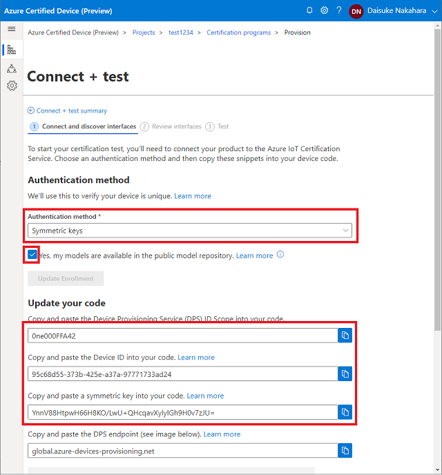
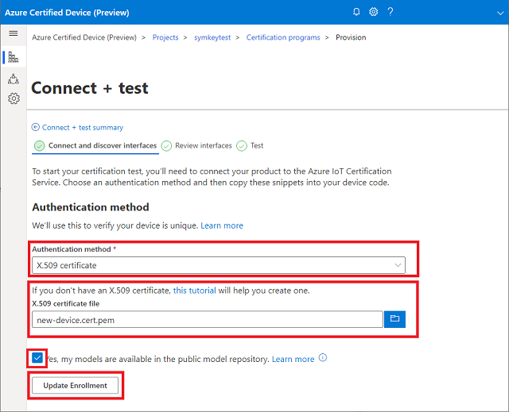
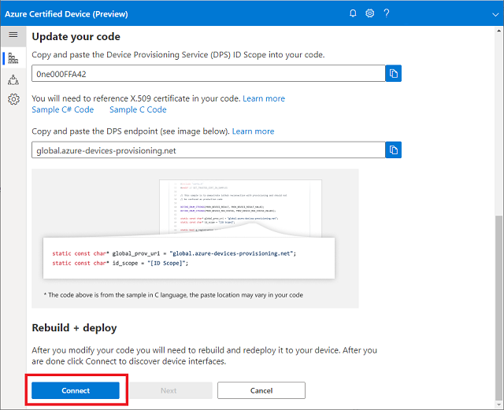
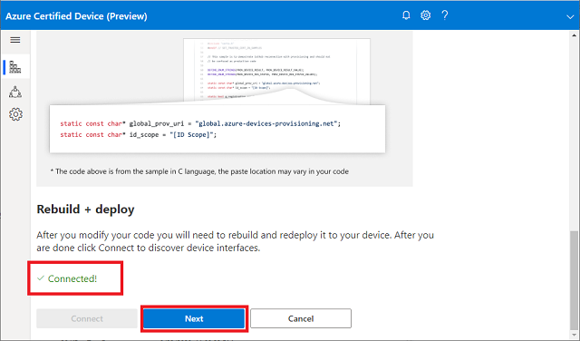
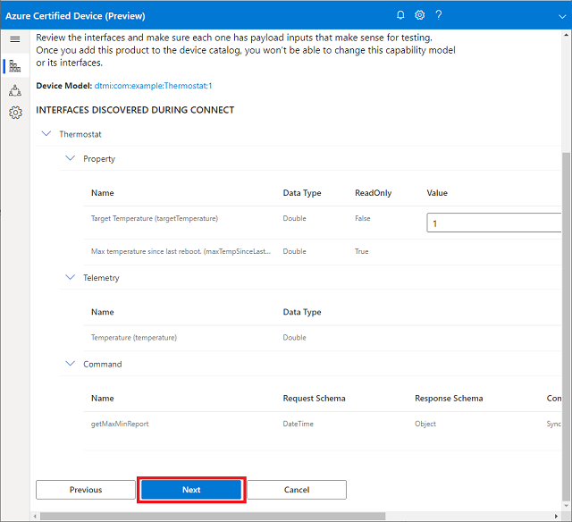
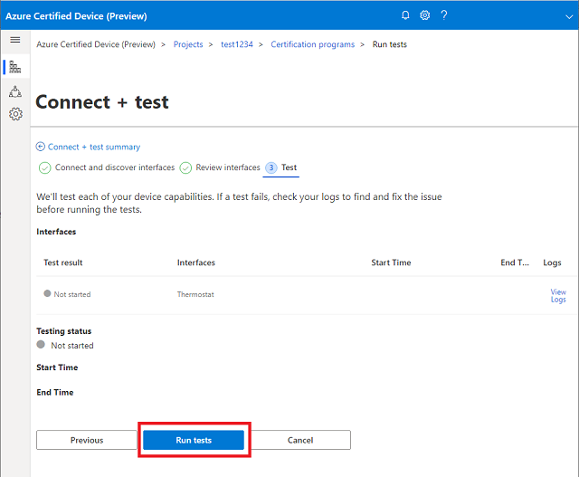
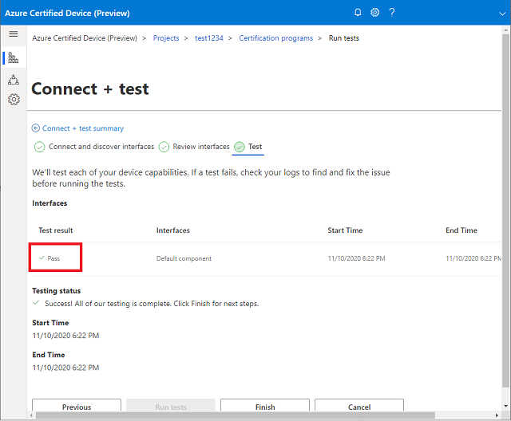

# IoT Plug and Play Simulator for Thermostat Device Model

This is a demo code with [Thermostat Device Model](https://github.com/Azure/iot-plugandplay-models/blob/main/dtmi/com/example/thermostat-1.json).

- Designed for IoT Plug and Play Certification demo
- Supports Symmetric Key and X.509 certificate authentication

## Setup Dev Environment

### Requirements

- Linux environment  

    Ubuntu, Raspberry Pi or WSL

- Toolchain

### Install pre-requisite

1. Install required libraries  

    ```bash
    sudo apt-get update
    sudo apt-get install -y git cmake build-essential curl libcurl4-openssl-dev libssl-dev uuid-dev
    ```

1. Clone this rep  

    ```bash
    git clone https://github.com/microsoft/IoT-Plug-and-Play-Workshop.git && \
    cd IoT-Plug-and-Play-Workshop/Demo/Certification/Simulator
    ```

1. Clone Azure IoT SDK C and generate self signed X.509 certificate with :  

    ```bash
    ./prep.sh
    ```

## Create a new project for Azure Certified Device

<https://certify.azure.com/>

1. Select **Connect & test**
1. Select **X.509 certificate** for Authentication Method
1. Select **./cmake/new-device.cert.pem** for X.509 certificate file

## Configuring Authentication Method

You can select X.509 or Symmetric Keys to run the demo.

### Symmetric Key



1. Browse to Azure Certified Device portal
1. Create a new project
1. Select `Connect + test`
1. Click `Run tests` for IoT Plug and Play
1. Select `Symmetric Keys` for Authentication method
1. Select the checkbox saying `Yes, my models are available in the public model repository.`
1. Click `Add Enrollment`
1. Open ./run.sh with your favorite text editor
1. `set` DPS_IDSCOPE to the ID Scope provided by the portal
1. `unset` DPS_X509
1. `set` DPS_DEVICE_ID and DPS_SYMMETRIC_KEY

    Example : 
    ```bash
    # Set ID Scope for DPS
    export DPS_IDSCOPE='0ne000FFA42'

    # Detemines type of DPS attestation
    # set DPS_X509 for X.509
    # unset DPS_X509 for Symmetric Key
    export DPS_X509=1
    unset DPS_X509

    # for Symmetric Key Provisioning
    # Get Device ID and Symmetric Key from the certification portal
    export DPS_DEVICE_ID='8cfea9d9-3844-4e62-b6cc-c6be324453df'
    export DPS_SYMMETRIC_KEY='dw88wVI0yd2E86cwN+PkczUNhDG4tGRPT2GwphsQJnE='
    ```

### X.509 Certificate



1. Browse to Azure Certified Device portal
1. Create a new project
1. Select `Connect + test`
1. Click `Run tests` for IoT Plug and Play
1. Upload `./cmake/new-device.cert.pem` to the portal, then click `Add Enrollment`
1. Select the checkbox saying `Yes, my models are available in the public model repository.`
1. Click `Add Enrollment`
1. `set` DPS_IDSCOPE to the ID Scope provided by the portal
1. `Set` DPS_X509 (or remove/comment out `unset DPS_X509`)

    Example :
    ```bash
    # Set ID Scope for DPS
    export DPS_IDSCOPE='0ne000FFA42'

    # Detemines type of DPS attestation
    # set DPS_X509 for X.509
    # unset DPS_X509 for Symmetric Key
    export DPS_X509=1
    # unset DPS_X509

    # for Symmetric Key Provisioning
    # Get Device ID and Symmetric Key from the certification portal
    export DPS_DEVICE_ID=''
    export DPS_SYMMETRIC_KEY=''
    ```

## Running the demo

1. Run the app with  

    ```bash
    ./run.sh
    ```
1. Confirm the device is provisioned to IoT Hub

    Example :

    ```bash
    =======================================================
    Info: Common Name : IoTPnPCertDemoX_15945
    Info: Provisioning Status: PROV_DEVICE_REG_STATUS_CONNECTED
    Info: Provisioning Status: PROV_DEVICE_REG_STATUS_ASSIGNING
    Info: Registration Information received from DPS
    Info: IoT Hub     : certsvc-hub-prod-westus2.azure-devices.net
    Info: Device Id   : IoTPnPCertDemoX_15945
    Info: Connecting to IoT Hub
    =======================================================
    Reading X.509 Certificate
    Issuer     : /CN=Azure IoT Hub CA Cert Test Only
    Subject    : /CN=IoTPnPCertDemoX_15945
    =======================================================
    Info: IoTHubDeviceClient_LL_CreateFromDeviceAuth Success
    Info: Connected to iothub : certsvc-hub-prod-westus2.azure-devices.net
    ```

1. Continue the certification test by clicking `Connect` button

    

1. Confirm that the portal should find the device, then click `Next`

    

1. The simulator does not require any parameter changes.  Click `Next` 

    

1. Start automated test by clicking `Run tests`

    

1. In a few minutes, the test should complete with `Pass` status

    
