# Azure Digital Twins and Indoor Map

The sample IoT Solution is configured with Azure Digital Twins (ADT) and Azure Indoor Map.  With Indoor Map Data and feature state, you can visualize digital twin's properties in the indoor map.

Feature stateset is configure with following states to show different background colors of rooms based on rooms' temperature property.

<style>
    .heatMap {
        width: 70%;
        text-align: center;
    }
    .heatMap th {
    background: white;
    word-wrap: break-word;
    text-align: center;
    }
    .heatMap tr:nth-child(1) { background: #CCF7FF; }
    .heatMap tr:nth-child(2) { background: #33FFFF; }
    .heatMap tr:nth-child(3) { background: #00E600; }
    .heatMap tr:nth-child(4) { background: #1966FF; }
    .heatMap tr:nth-child(5) { background: #ff6d2e; }
    .heatMap tr:nth-child(6) { background: #FF1919; }
</style>


```json
{
  "styles": [
    {
      "keyname": "temperature",
      "type": "number",
      "rules": [
        {
          "range": {
            "exclusiveMaximum": 20
          },
          "color": "#CCF7FF"
        },
        {
          "range": {
            "minimum": 20,
            "exclusiveMaximum": 30
          },
          "color": "#33FFFF"
        },
        {
          "range": {
            "minimum": 30,
            "exclusiveMaximum": 40
          },
          "color": "#a4ff2e"
        },
        {
          "range": {
            "minimum": 40,
            "exclusiveMaximum": 50
          },
          "color": "#ff2eff"
        },
        {
          "range": {
            "minimum": 50,
            "exclusiveMaximum": 60
          },
          "color": "#ff6d2e"
        },
        {
          "range": {
            "minimum": 60
          },
          "color": "#FF1919"
        }
      ]
    }
  ]
}
```

## Sending Digital Twin property changes to Azure Indoor Map

In order for the feature set style to reflect property changes to Azure indoor map, we can forward `Twin Change` events to Azure Functions.  Azure Functions then sets state of map data (or room, in this case).

### Creating a new `Event Endpoint`  

This is to specify how events are published.  We will use Event Grid to publish `Digital Twin events`.  

> [!TIP]  
> Right click the button below and select **Open link in new tab** or **Open lin in new window**

1. Click **Deploy to Azure** button below

  <a href="https://portal.azure.com/#create/Microsoft.Template/uri/https%3A%2F%2Fraw.githubusercontent.com%2Fmicrosoft%2FIoT-Plug-and-Play-Workshop%2Fmain%2FDeployment%2FCreateADTEventGrid.json" target="_blank"></a>  

1. Ensure you select the same subscription, Resource Group, and Unique ID used for **[the Sample IoT Solution](Deployment.md)**
1. Deploy Azure Digital Twins event endpoint by following ARM template deployment
1. Ensure a new endpoint named `ADTEventGridEP` is deployed in your Azure Digital Twins instance  

  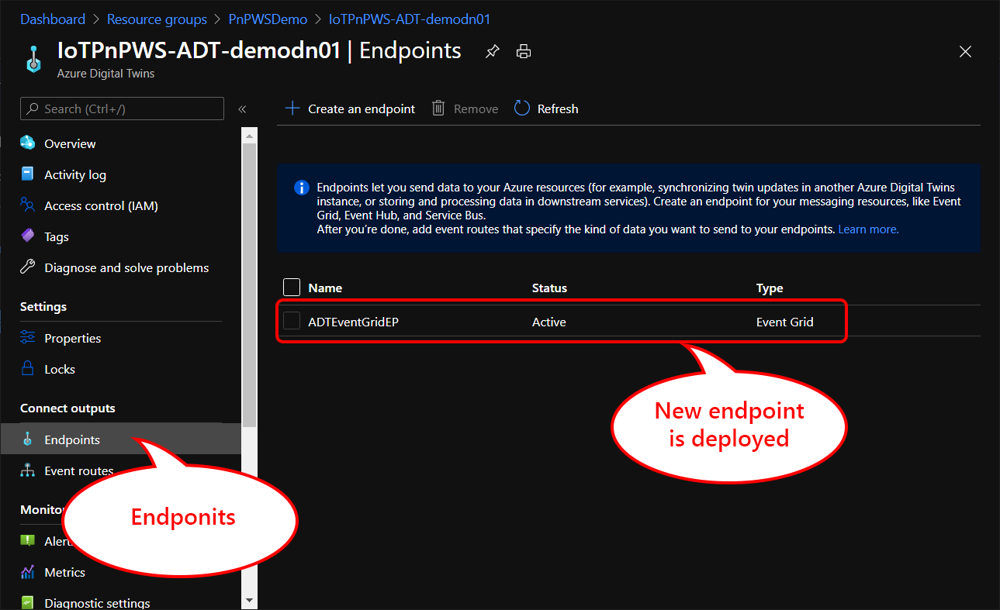

### Creating a new `Event Route`

With a new endpoint, we need to configure how to route events.  This is called **event route**.

1. Select `Event routes` from the left menu
1. Click `+ Create an event route`  

  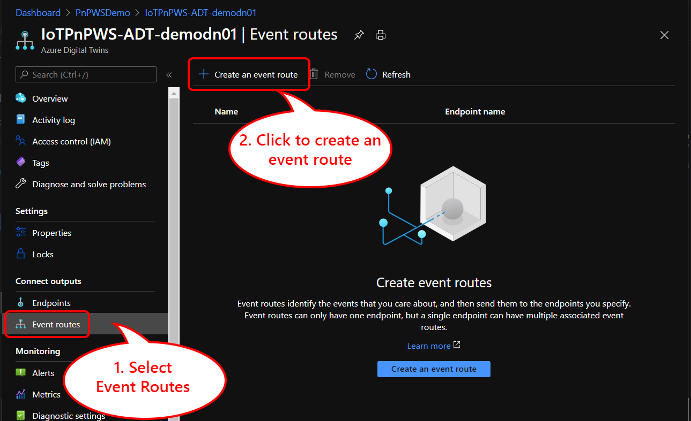

1. Give a name to the new event route  
  E.g. MyAdtEventRoute

1. Select `ADTEventGridEP` from the **Endpoint** list
1. Select `Twin Update` from **Event types** list to publish twin update change events
1. Click `Save` to save the new event route

  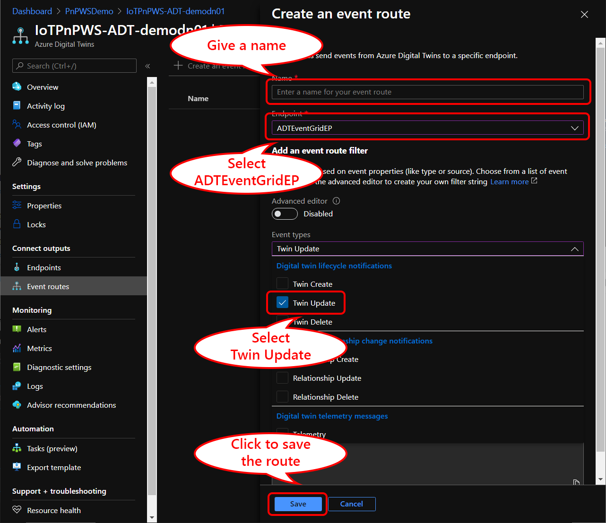

## Updating digital twin to send twin update event

By changing properties of room141's twin, ADT publishes Digital Twin update events to Azure Functions.  Azure functions, then, updates state of corresponding room data in the Indoor Map dataset.

1. In ADT Explorer, click `+' button of `Room` model to add a new twin
1. Give a name to the new twin  

  E.g. Office001

  This becomes digital twin ID so it has to be a valid Twin ID.  
  
    - Characters : A-Z a-Z
    - Numbers : 0-9
    - Special Characters : - . + % _ # * ? ! (), = $ '

  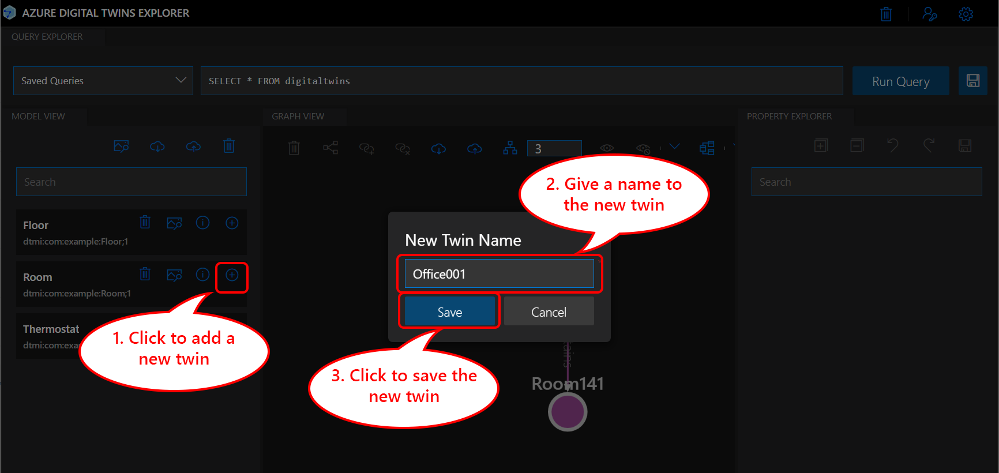

1. Click the newly created digital twin (e.g. Office001) to display properties

  Notice that `Room Number` is not yet assigned to this digital twin.

  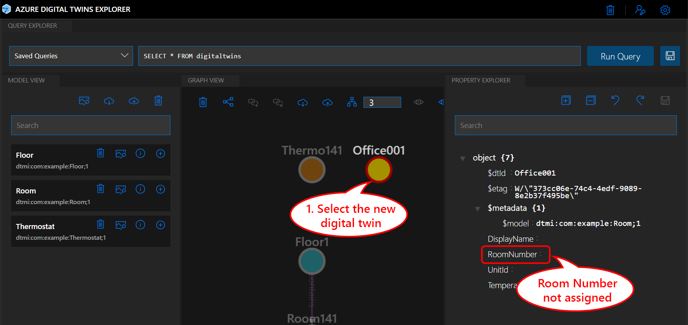

1. Assign any `Room Number` from ths Indoor Map  

  E.g. Assigning `Room 101` to `Office001`

1. Set `Temperature` for the room
1. Click `Save` button to save digital twin property update

  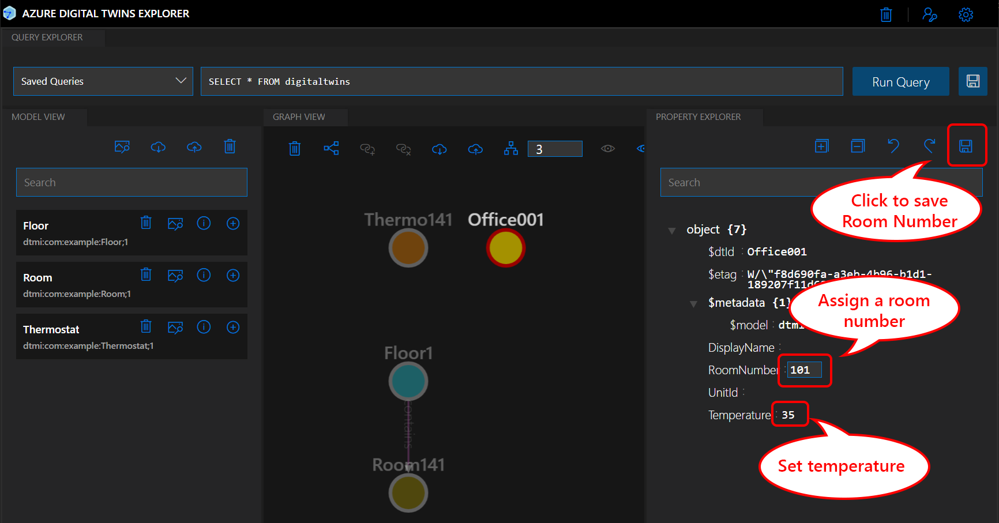

1. Switch to browser tab for the sample IoT Solution

  Wait for a few seconds, or click `Reload` button to refresh browser view

Based on the temperature setting, the background color of the assigned room changes.  
Change temperature value again to see how digital twin property data is reflacted in Indoor Map.

<div class="heatMap">

| Temperature | Color |
| -- | -- |
| < 20 |  #CCF7FF |
| 20 < 30 |  #33FFFF |
| 30 < 40 |  #a4ff2e |
| 40 < 50 |  #ff2eff |
| 50 < 60 |  #19FFD9 |
| 60 <  |  #FF1919 |

</div>

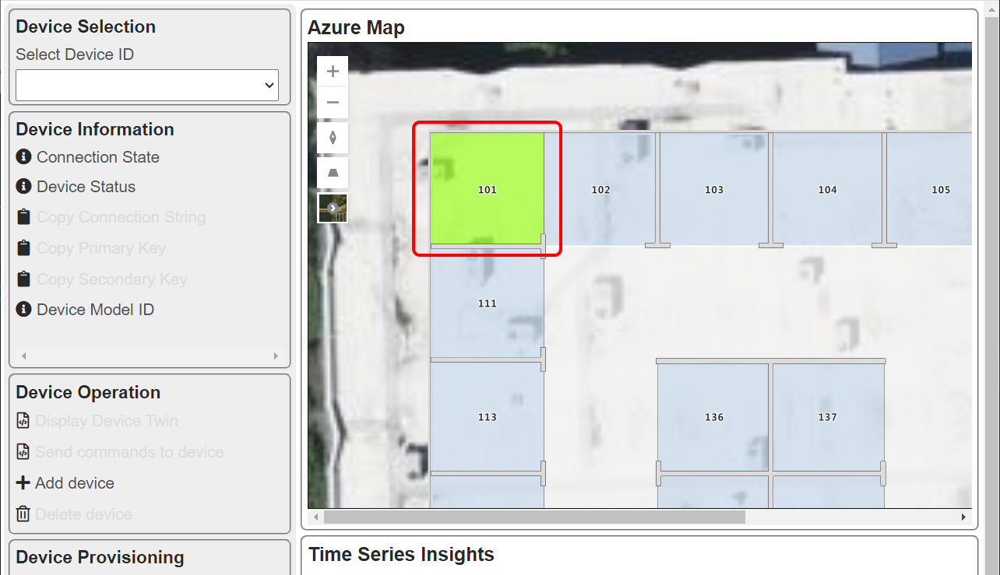

## Connecting data from IoT Device to Azure Digital Twin

In the previous step, you were able to see how Digital Twin property value (Temperature) can be used to visualize digital twin graph with Azure Indoor Map.
In this section, we will connect an IoT device with Temperature data to perform :

1. Digital Twin property of `Thermostat` twin is updated based on temperature telemetry from the device
1. Use digital twin relationship to update property of `Room` based on the device telemetry

### Updating device twin property based on device telemetry

The sample IoT Solution is configured to :

- Route device telemetry received by IoT Hub to Event Hubs
- Azure Function subscribes device telemetry from Event Hubs  
  The function name is `Telemetry_Processor`
- Telemetry_Processor function receives device telemetry
- Telemetry_Processor looks for a digital twin with `Device ID` = `Digital Twin ID`
- Telemetry_Processor resolves the IoT Plug and Play model, and looks for telemetry with Semantic Type = `Temperature`

  Example of Device Model with Semantic Type = Temperature (@type)

  ```json
  {
    "@type": [
      "Telemetry",
      "Temperature"
    ],
    "name": "temperature",
    "displayName": "Temperature",
    "description": "Temperature in degrees Celsius.",
    "schema": "double",
    "unit": "degreeCelsius"
  },
  ```

- Telemetry_Processor sets `Temperature` property of digital twin

Let's connect IoT Device to Digital Twin.

1. Switch to ADT Explorer

1. Select `Thermo141` digital twin and confirm `Temperature` property is not set (or zero)

  

1. Start Simple Thermostat simulator app  

  Refer to [this instruction](ConnectSimulator.md#running-the-simulator) how to run the Simple Thermostat simulator.
  Because Telemetry_Processor resolves IoT Plug and Play model, you can use any device with telemetry type = `Temperature`

1. De-select `Thermo141` then re-select `Thermo141` to confirm `Temperature` property is updated

  > [!TIP]  
  > Because ADT Explorer does not have `Refresh` button for digital twin properties, you need to de-select and re-select digital twin to view the latest property data

  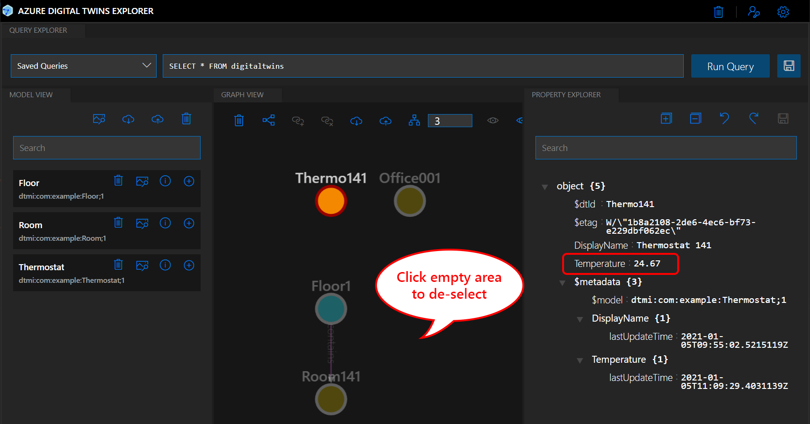

Switch to the sample IoT Solution now.  `Room141`'s background color does not change because `Thermo141` digital twin has no connection to `Room141`.
A relationship between `Room141` and `Thermo141` digital twin can be used to propagate property values.  In other words,

- `Thermo141` is a just sensor to report temperature data
- What we really care is the temperature of the room (`Room141`)
- Creating a relationship between `Room141` and `Thermo141` means "Temperature of Room 141 is what the thermostat 141 reports"

## Creating a relationship

Azure Digital Twins can generate (or publish) events based on Digital Twin Update, such as property update.  Using this as a trigger, we can propagate temperature telemetry set to `Thermo141` to `Room141`, by examining the relationship.  Digital Twin Relationship is a hierarchical structure, or parent-child relationship.

With the example building scneario digital twin relationship is configured :

- Floor contains rooms
- Room contains a thermostat

For the sake of the demo, the sample digital twin graph is very simple.  In the real world scenario, the graph should look like this :

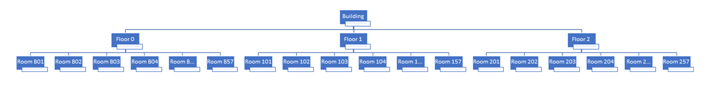

Let's create a relationship between `Room141` and `Thermo141`

1. Open ADT Explorer
1. Click `Room141` to select the digital twin
1. Hold `CTRL` key then click `Thermo141` to select the digital twin

  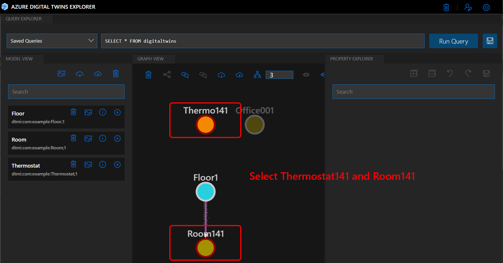

1. Click `Add Relationship` button to create a new relationship

  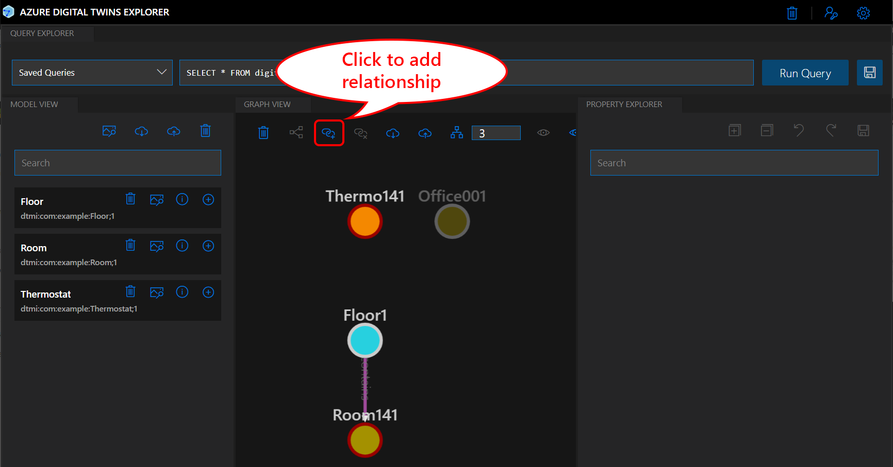

1. Set relationship details  

    - Source ID => `Room141`
    - Target ID => `Thermo141`
    - Relationship => `Contains`

1. Click `Save` to save the relationship

  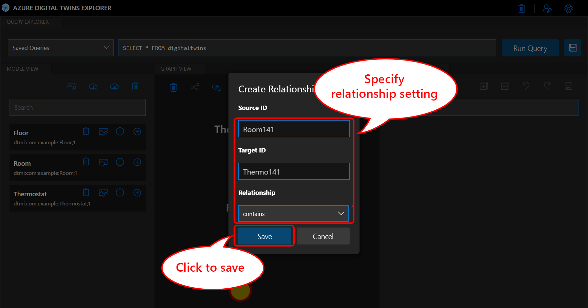

1. Ensure the new relationship is created  

  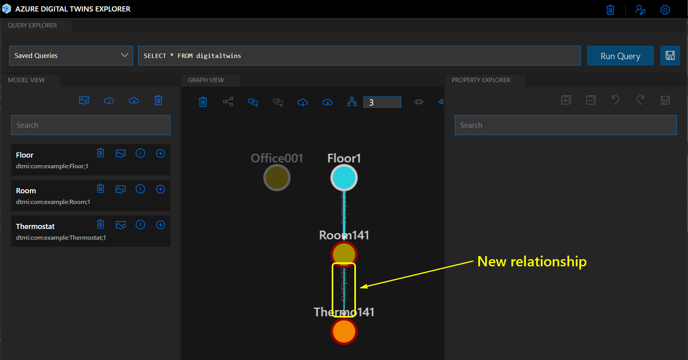

1. With the relationship, `Temperature` property value is propagated from `Thermo141` to `Room141`

    - Check `Temperature` property of `Thermo141` and `Room141`
    - Check Indoor Map.  The background color changes based on `Temperature` value

## Completed

You completed :

- Create Azure Digital Twins graph
- Visualize Digital Twin Graph with ADT Explorer
- Connect IoT Plug and Play device to Azure Digital Twins
- Created a relationship to propagate telemetry data to digital twins
- Visualize digital twin property with Azure Indoor Map

Congratulations.  You completed IoT Plug and Play hands on lab!

[Return](../README.md) to the top page