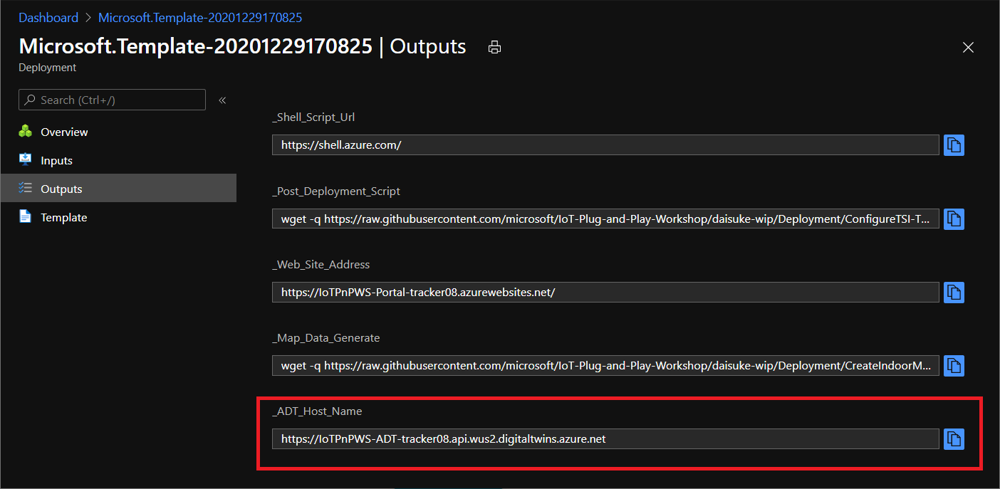
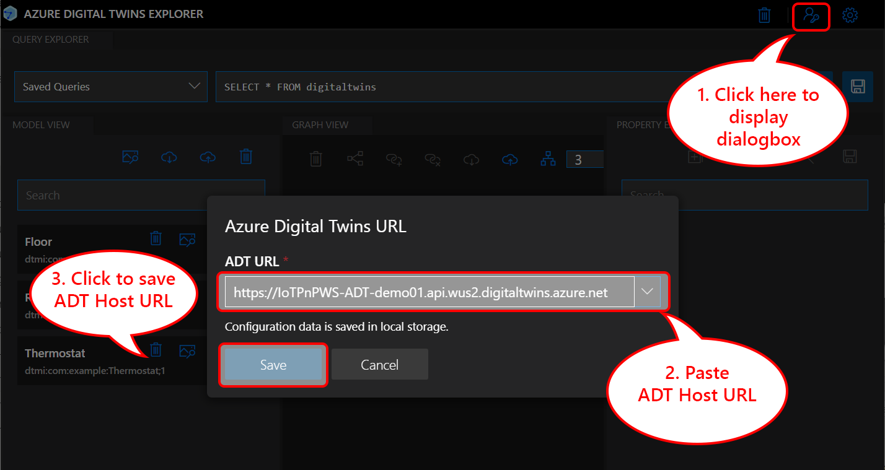
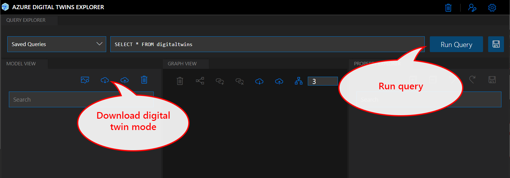

# ADT Explorer

ADT Explorer is a GUI tool written with Node.js to visualize Digital Twin graph, nodes, and models.

Please ensure Node.js is installed on your host PC environment.

```bash
C:\>node --version
v14.15.1

C:\>npm --version
6.14.8
```

## Installing Node.js and AZ CLI

> [!CAUTION]  
> Node.js version 15 may cause issues.  Recommend to use Node.js version 12 or 14.

1. Install Node.js ver 12+ LTS from <https://nodejs.org/>  
1. Install [AZ CLI](https://docs.microsoft.com/cli/azure/iaznstall-azure-cli)

### Windows 10

1. Download Node.js from <https://nodejs.org/>  
  Tested with version 14.15.1
1. Run downloaded `node-v14.15.1-x64.msi`
1. Follow the installer wizard to install Node.js
1. Download AZ CLI installer from <https://aka.ms/installazurecliwindows>
1. Run downloaded `azure-cli-<version number>.msk`
1. Follow the installer wizard to install AZ CLI

### Ubuntu

```bash
sudo apt-get install curl && \
curl -sL https://deb.nodesource.com/setup_12.x | sudo -E bash - && \
sudo apt-get install -y nodejs && \
curl -sL https://aka.ms/InstallAzureCLIDeb | sudo bash
```

### Ubuntu (WSL)

```bash
sudo apt-get install curl && \
curl -o- https://raw.githubusercontent.com/nvm-sh/nvm/v0.35.3/install.sh | bash && \
curl -sL https://aka.ms/InstallAzureCLIDeb | sudo bash
```

Exit Ubuntu WSL by :

```bash
exit
```

Restart Ubuntu WSL from `Start` menu then install Node.js with :

```bash
nvm install node v14.15
```

## Setting up ADT Explorer

Download and initialize ADT Explorer with :

```cmd
git clone https://github.com/Azure-Samples/digital-twins-explorer && \
cd digital-twins-explorer/client/src && \
npm install 
```

## Setting up user credential for ADT access

ADT Explorer uses the current logged in user credential.  Please log in to Azure prior to running ADT Explorer.

Log in to Azure from the host PC with :

```bash
az login
```  

> [!NOTE]  
> If you have multiple subscriptions, please select subscription in which your ADT instance is deployed.  
>
> ```bash  
>  az account list --output table
>  az account set --subscription "subscription ID or name"
> ```  

## Running ADT Explorer

1. Run ADT Explorer with :

  ```bash
  npm run start
  ```

  The default web browser should open with `https://localhost:3000`

  > [!NOTE]  
  > Ignore the authentication error if you see it.

1. Copy ADT Host Name from the deployment output window

  

1. Save `ADT Host Name` to ADT Explorer  

  

## Verify Access to ADT

Since there is no digital twin models nor digital twins, ADT explorer does not display anything.  Howevever, on successful installation and configuration, you can run query etc.

Ensure you do not see error when you try to download models and graph.



## Completed

ADT Explorer is successfully installed and configured.  Now you can add Digital Twin models and digital twins.

## Next Step

[Continue on Azure Digital Twins hands on lab](AzureDigitalTwins.md#creating-digital-twin-models-and-digital-twins)

[Return](../README.md) to the top
