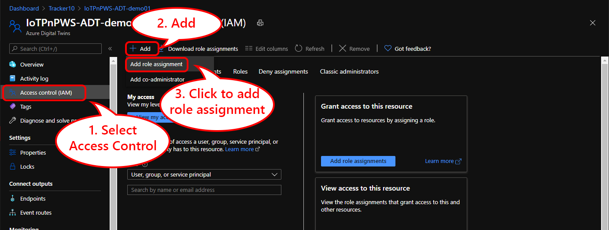
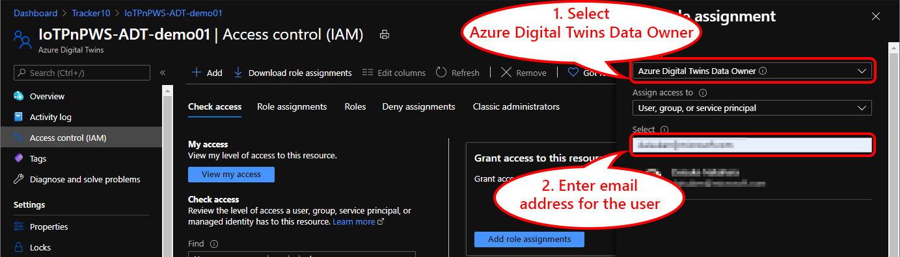
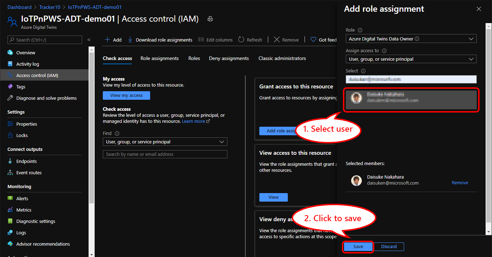
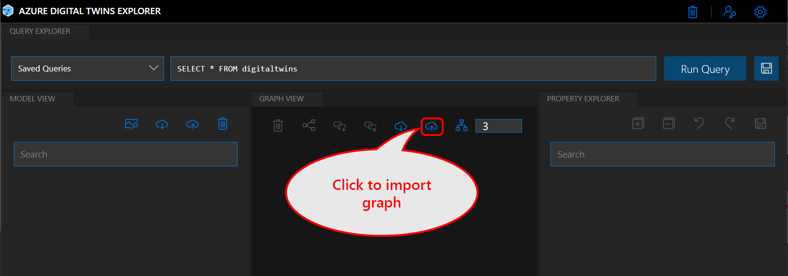
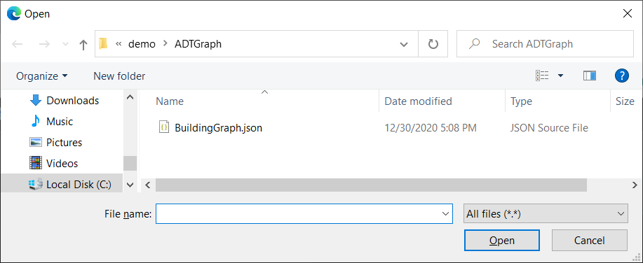
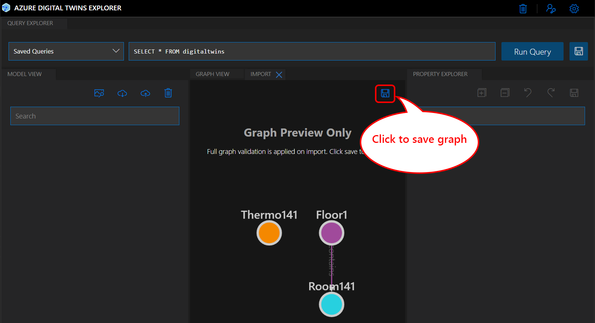
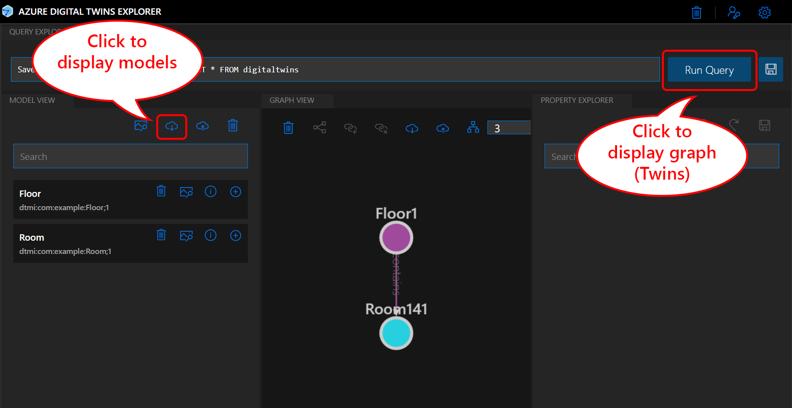
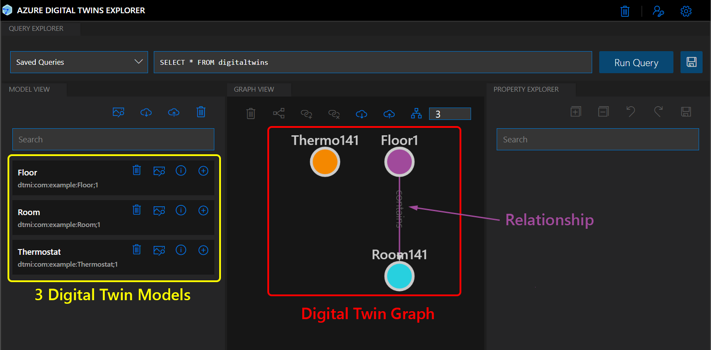
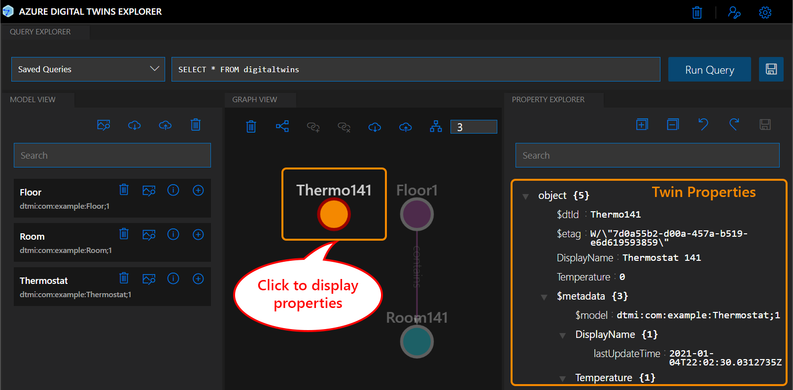

# Adding Azure Digital Twins graph to the sample solution

Azure Digital Twins instance is already installed as a part of the sample solution.  However, in order to use Digital Twins, you must register Digital Twin models written in Digital Twin Definition Language (DTDL), then create digital twin nodes using these models.

## Digital Twin Model

User defined twin models are used to build your twin graph in the self-defined terms of your needs.  A model defines characteristics of physical objects, such as Room or Sensor.  A model contains data such as properties, telemetry, events, and commands.

You can create digital twin models with API or various tools.  In this instruction, we will use ADT CLient sample application to create digital twin models.

## Digital Twin and Digital Twin Graph

A digital twin is an instance of your digital twin models.  It can connect to other digital twin(s) via relationships to for a twin graph.  The twin graph is the representation of your entire environment.

You can create digital twins with API or various tools such as AZ CLI with Azure Digital Twins extension.  In this instruction, we will use ADT Client sample application to create digital twins.

## Preparation

1. Grant access to Azure Digital Twins instance with your credential
1. Install and configure tool(s) to access ADT instance

## Granting access to ADT instance

Similar to other Azure platform services, you can manage permission, or Role Based Access Control (RBAC), to ADT instance to control access.
In order to access ADT instance, you must add user(s) who needs to access ADT graph, models, etc.

1. Open the web browser and navigate to [Azure Portal](https://portal.azure.com) 
1. Select resource group you created for this hands on lab
1. Select `Azure Digital Twins` instance in the resource group
1. Select `Access control (IAM)`  
  
1. Select `Azure Digital Twins Data Owner` from the `Role` list box
1. Enter **email address** for the user to grant access
  
1. Select user then click `Save`
  

## Setting up ADT Explorer

ADT Explorer (GUI tool) and/or ADT Client App (CLI tool) are examples of user interface tools.  In order to access ADT instance, we will : 
 
1. [Set up ADT Explorer](ADTExplorer.md) to visualize and manipulate digital twin graph, digital twins, and digital twin model
1. [Set up ADT Client App](ADTClient.md) to create digital twin model and digital twins  
  Optional : In you would like to try CLI interface to call Digital Twin APIs, install ADT Client sample app.

## Creating digital twin models and digital twins

In this hands on lab, we will create a digital twin graph for a building.  There are a few options to create Digital Twin models, Digital Twins, and relationships.

1. Using a GUI tool which makes API calls
1. Using a command line tool that makes calls

You may choose either or both methods described below.

### Creating Digital Twin Graph with ADT Explorer

Import graph data located in `\demo\ADTGraph` with ADT Explorer.

1. Click `Import Graph`  

    

1. Select `BuildingGraph.json` located in `<Clone Folder>\demo\ADTGraph`  

    

1. ADT Explorer should show a preview with `Floor1`, `Room141`, and `Thermo141`  

    Click `Save` button to import the graph  

    

1. Ensure 3 models, 3 twins, and 1 relationship are imported successfully  

    

### Creating Digital Twin Graph with APIs (Optional)

ADT Client app calls APIs to create digital twin models, digital twins, and relationships.
Configure and start ADT Client app then run following commands to create ADT graph :

> [!IMPORTANT]  
> If you already created digital twin graph, ensure to remove them before running this command with :
>
> ```bash
> DeleteAllTwins
> DeleteAllModels
> ```

```bash
SetupBuildingScenario
```

This command will creates models based on json files written in DTDL v2.
Model definition files are located in `\demo\ADTClient\Models` folder

- Digital Twin models for Floor, Room, and Thermostat
- Digital Twins for `Floor 1`, `Room 141`, and `Thermostat 141`
- Relationship between `Floor 1` and `Room 141`

## Visualizing Digital Twin Graph

You can visualize followings with ADT Explorer

- Digital twin models
- Digital twins
- Relationships
- Properties of each twin

1. Click `Run Query` and `Download Models` to show twins and models in ADT Explorer  

    

1. Ensure ADT Explorer shows 3 models, 3 twins, and 1 relationship  

    

1. Select `Thermo141` to display properties of `Thermo141` twin

    

## Completed

ADT instance is successfully updated with 3 digital twin models, 3 digital twins, and 1 relationship for the example building scenario. 

## Next Step

[Visualizing digital twin property with the indoor map](ADT-IndoorMap.md)

[Return](../README.md) to the top page