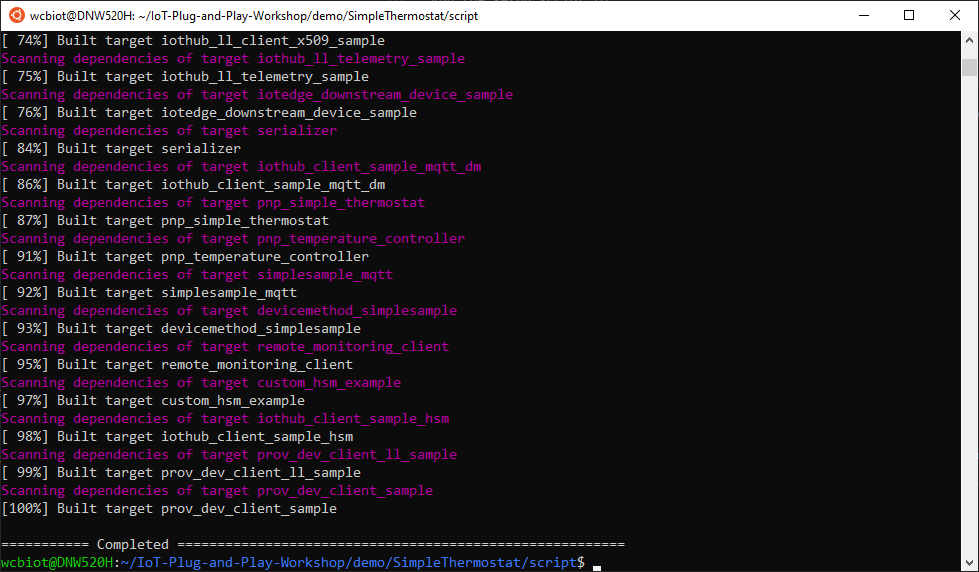
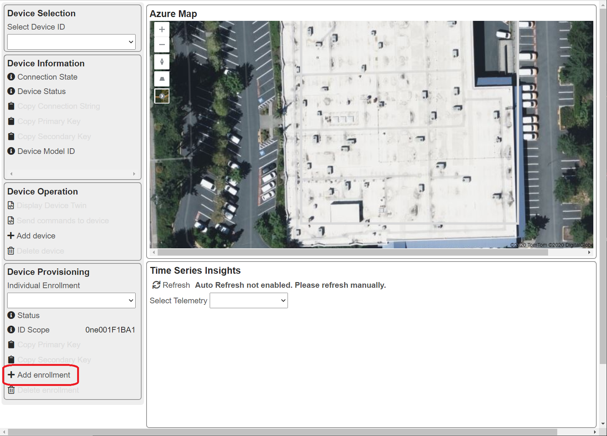
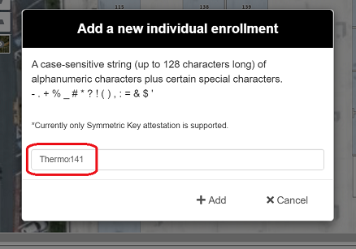
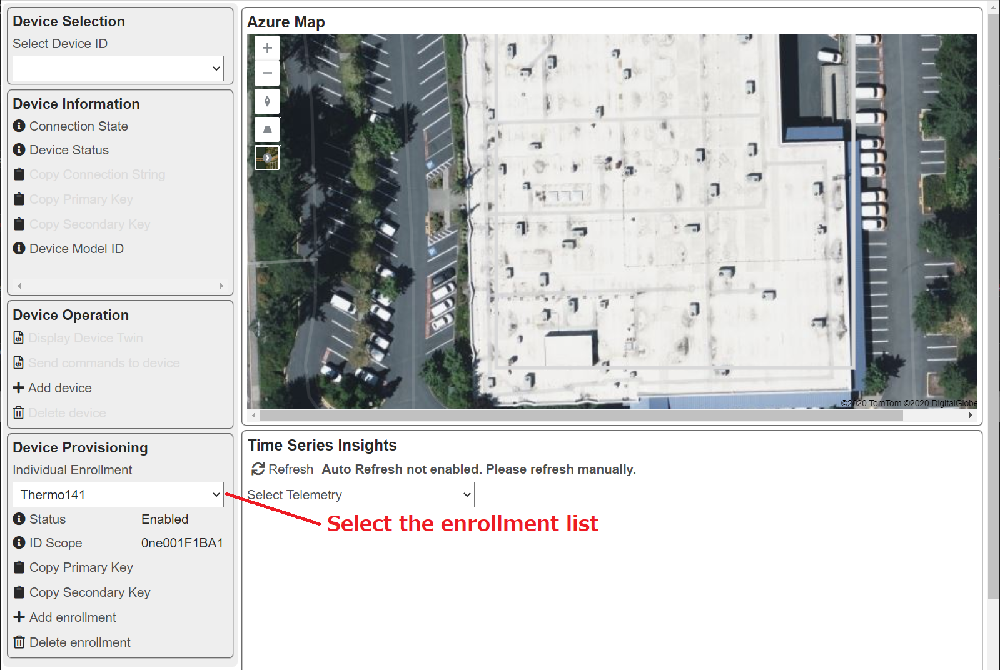
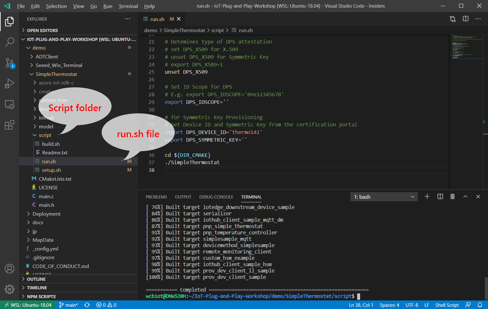
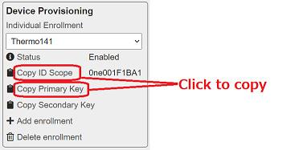
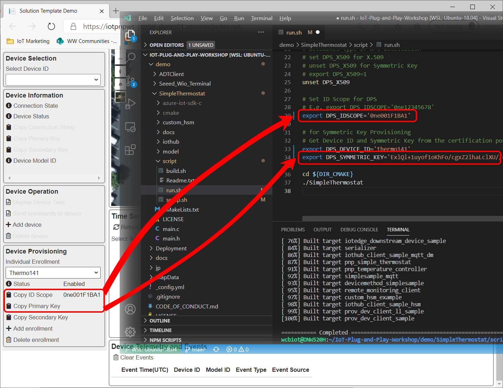
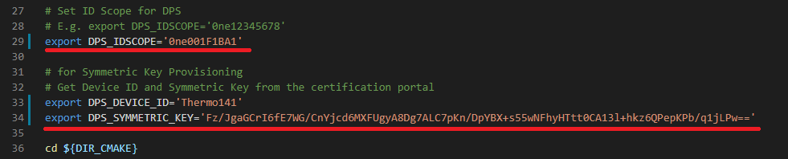
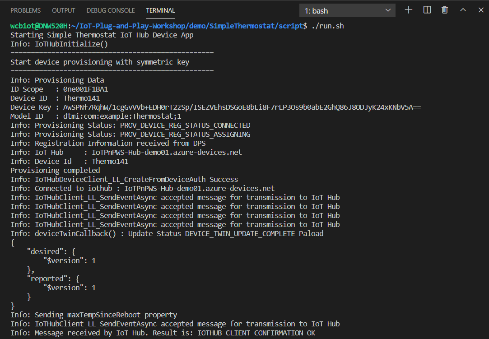
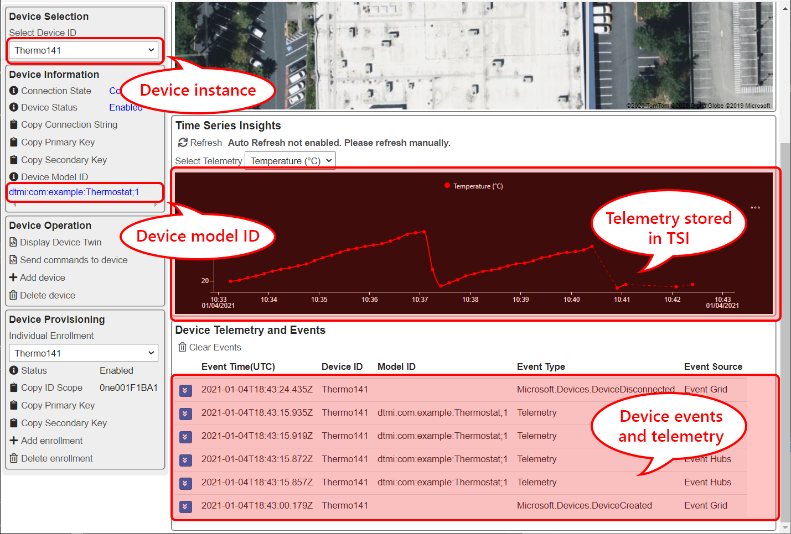

# Connecting a simulator device to the sample IoT Solution

In order to connect a device, the device must be registered to the solution to ensure the device is valid and is trusted.  You may register a new device directly to IoT Hub or through Device Provisioning Service (DPS).

[Read more on device provisioning](IoT-Device-Management.md)

Since devices must be trusted, connecting devices requires device authentication.  IoT Hub supports 3 types of device authentication methods.  

1. [Symmetric Key](https://docs.microsoft.com/en-us/azure/iot-dps/concepts-symmetric-key-attestation)
1. [X.509 Certificate](https://docs.microsoft.com/en-us/azure/iot-dps/concepts-x509-attestation)
1. [Trusted Platform Module](https://docs.microsoft.com/en-us/azure/iot-dps/concepts-tpm-attestation) (TPM)

[Read more on security practices](https://docs.microsoft.com/en-us/azure/iot-dps/concepts-device-oem-security-practices)

X.509 attestation mechanism is an excellent way for scale production.  You may use self-signed certificate or the root certificate signed by a trusted root certificate authority (CA).

[Read more on Digital Signature](DigitalSignature.md)

In this hands on lab, we will use simple symmetric key to provision a device.

You may use any IoT Plug and Play certified devices you have.  If you do not have one, you may use the simulator in this repo.

- Set up a simulator
- Create an enrollment list in DPS
- Provision device through DPS

## Setting up a simulator device

In this hands on lab, you will install required tools and recipes on **Linux** environment.

### Requirements

- Linux environment  
  - Ubuntu 18.04
  - Raspberry Pi with Raspbian 10 (Buster)
  - Windows Subsystem for Linux (Tested with [Ubuntu 18.04 LTS](https://www.microsoft.com/store/productId/9n9tngvndl3q))

- Tool chain  
Follow [Install pre-requisite](#install-pre-requisite) below to install tools and libraries.

- A text editor  
You can use your favorite text editor or Visual Studio Code.  

  - [Visual Studio Code](https://code.visualstudio.com/download)
  - [Remote WSL extension](https://marketplace.visualstudio.com/items?itemName=ms-vscode-remote.remote-wsl) if you are running WSL
  - [Remote SSH extension](https://marketplace.visualstudio.com/items?itemName=ms-vscode-remote.remote-ssh) if you are running Ubuntu or Raspbian on physical device

### Install pre-requisite

1. Install required tools and libraries with :  

    ```bash
    sudo apt-get update && \
    sudo apt-get install -y git cmake build-essential curl libcurl4-openssl-dev libssl-dev uuid-dev
    ```

1. Clone this repo  

    ```bash
    cd ~ && \
    git clone https://github.com/microsoft/IoT-Plug-and-Play-Workshop.git && \
    cd IoT-Plug-and-Play-Workshop/demo/SimpleThermostat/script/
    ```

### Compile the app

Run the setup script to :  

- Clone Azure IoT SDK C
- Build SimpleThermostat simulator application  

> [!NOTE]  
> This process may take several minutes depending on your internet connection speed

```bash
./setup.sh
```

Example with WSL Ubuntu 18.04 LTS :



## Create a new enrollment list in DPS

1. Click `+ Add enrollment`  

    This will display a dialog box

    

1. Enter a new Registration ID  

    The Registration ID becomes a device name in the solution.  

    

    > [!IMPORTANT]  
    > The device name (or Registration ID) is case sensitive

1. Click `+ Add` to create a new enrollment list

## Provision device through DPS

In order to provision a device, the device needs authentication information (Symmetric Key in this example).  We will take enrollment information including a symmetric key from the sample IoT Solution and program the device with these information.

1. In the sample IoT Solution, select the enrollment you just created from ths list  

    

1. Switch to `Simple Thermostat` and open `run.sh` file in `/demo/SimpleThermostat/script` folder  

    

1. Change `DPS_DEVICE_ID` at line #29 to the name you used in the enrollment  

    e.g. Thermo141

1. Copy `ID Scope` from the sample IoT Solution, then paste to line #29 for `DPS_IDSCOPE` in `run.sh` file  

1. Copy `Primary Key` or `Secondary Key` from the sample IoT Solution, then paste to line #34 for `DPS_SYMMETRIC_KEY` in `run.sh` file

    > [!TIP]  
    > You can click `Copy ID Scope` and `Copy Primary/Secondary Key` to copy values  
    >  
    > 

    

1. Save `run.sh` file  

    `run.sh` file should look like this :  

    

## Running the simulator

1. Run the app with :  

    Example with the repo cloned to home directory (`~/`)

    ```bash
    cd ~/IoT-Plug-and-Play-Workshop/demo/SimpleThermostat/script
    ./run.sh
    ```

1. Ensure there is no error  

    Example output

    

1. Confirm the device is provisioned and telemetry is received by the sample IoT Solution  

    When a device is provisioned, you should see followings in the sample IoT Solution

    - Device Instance  
        The new device instance is listed in `Device Selection` list box
    - Device Model ID  
        The new device provisioned with IoT Plug and Play Device Model ID
    - Device Events  
        Microsoft.Devices.DeviceCreated and Microsoft.Devices.DeviceConnected events
    - Telemetry  
        Telemetry is sent to Time Series Insights.  To view a line chart, select `Temperature (C)` from `Select Telemetry` list box.

    

## Completed

The simulator device is now connected to the sample IoT Solution. In summary :

- The simulator device is provisioned through DPS
- The simulator device is connected to IoT Hub
- The simulator device is sending telemetry to IoT Hub  
    For the demo purpose, the simulator cycles through temperature data from 20 ~ 50 degrees in celsius  
- Telemetry is saved in TSI so the data can be visualized in a line chart
- The web portal is receiving **device events** and **telemetry**

Now you may stop the simulator by pressing `CTRL + C`

## Next Step

[Create Azure Indoor Map data](./IndoorMap.md)

[Return](../README.md) to the top page
