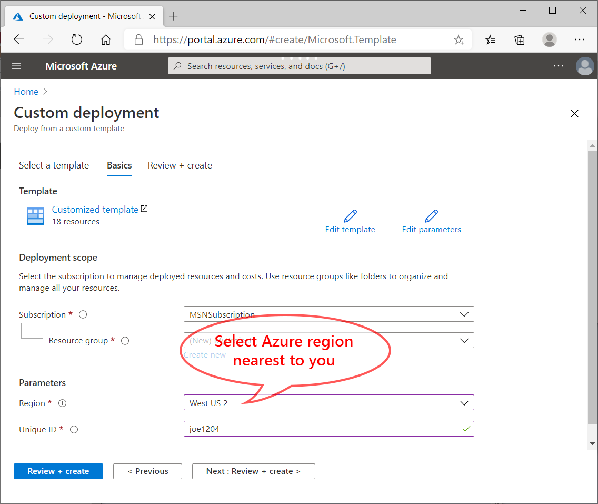
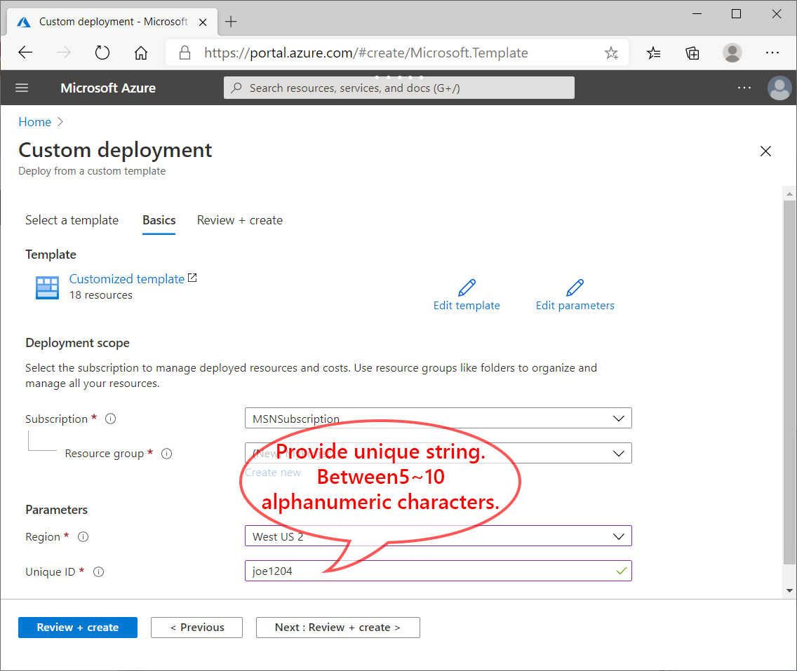
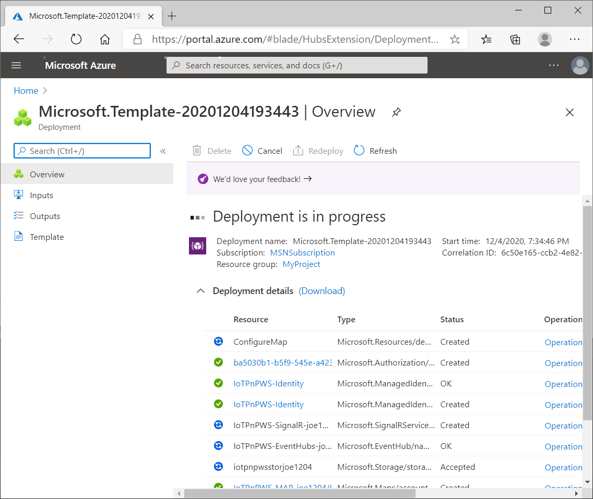
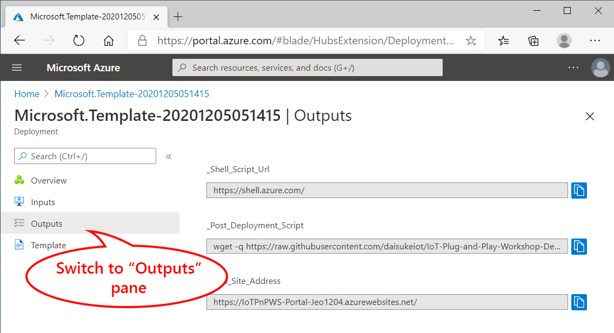
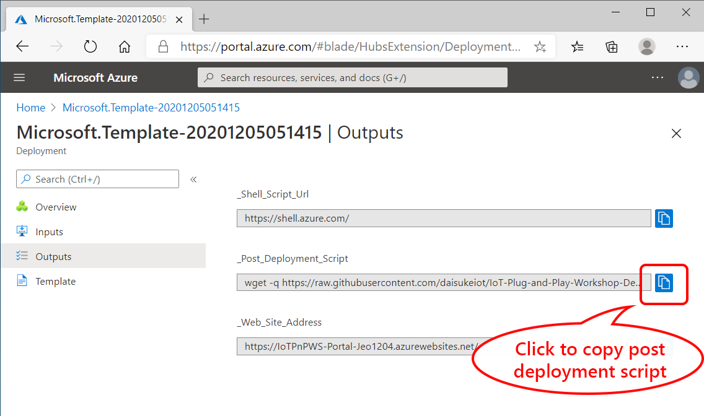
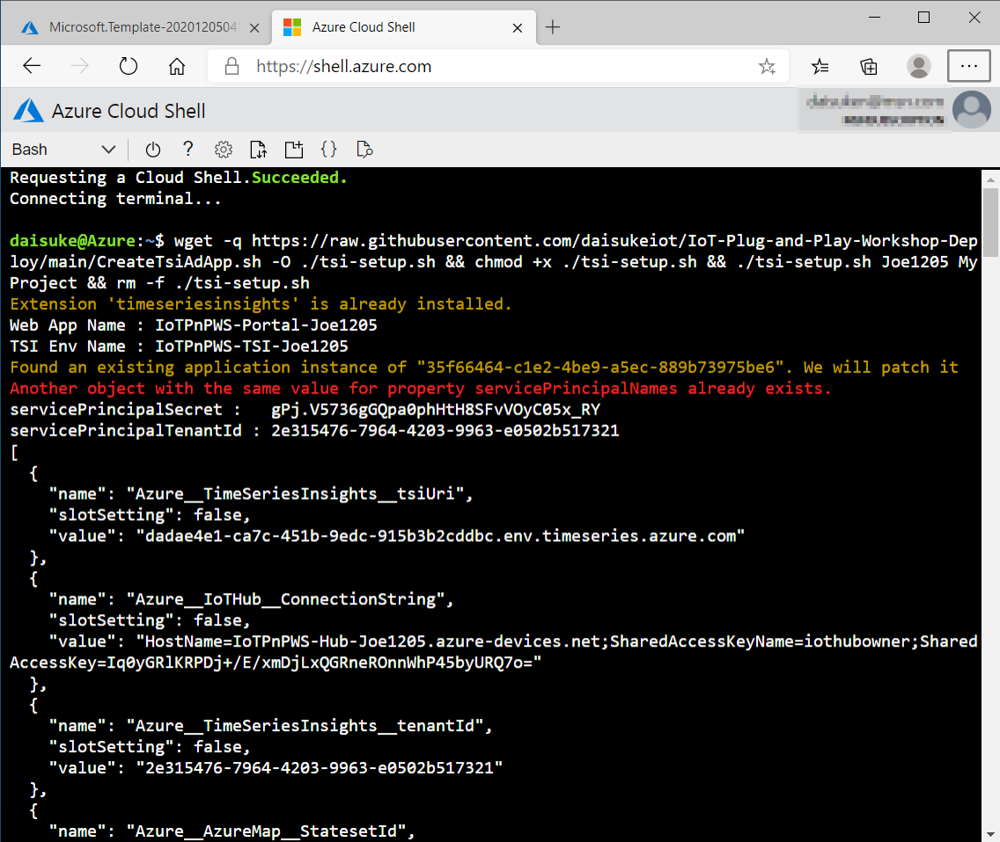
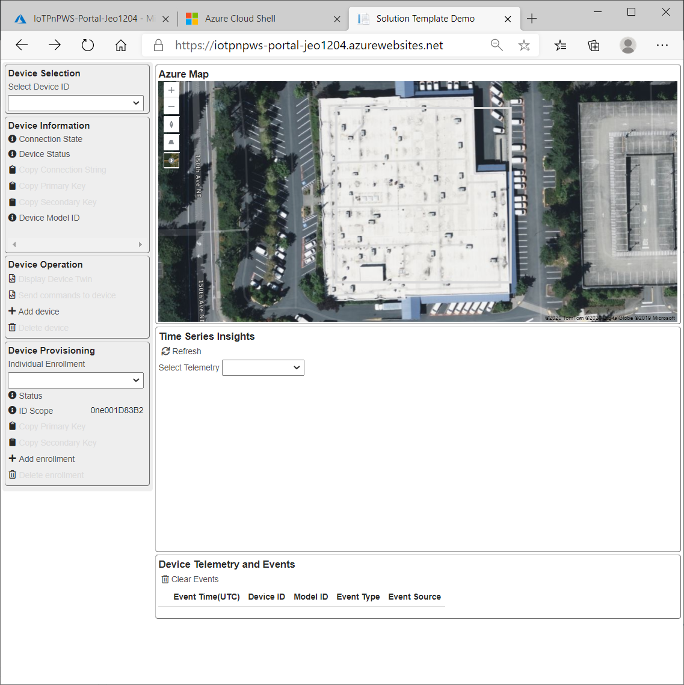

# Deploying Sample IoT Solution

This document walks through how to deploy Sample IoT Solution Application.
There are 2 major steps to deploy the sample IoT Solution.

1. With Azure Resource Manager (ARM) template, deploy 18 Azure services and configure services
1. Run the post deployment script to configure access permissions among services

## Requirements

- Azure Subscription  
    If you do not have Azure Subscription, please create an account for free (12 months)  
    <https://azure.microsoft.com/free/>  
    You must be an administrator or an owner of the subscription  
- A PC with Web Browser
- Azure Resource Providers
    Please ensure Container Instance is enabled

## 1. Start Deployment

Click **Deploy to Azure** button below  

ADT Version (For testing)

> [!TIP]  
> Right click the button below and select **Open link in new tab** or **Open lin in new window**

## 2. Create a new resource group

A resource group is a container that holds related resources for an Azure solution.  Similar to folder and files.

1. Select **Subscription** (if you have more than one)
1. Create a new **Resource Group** by clicking **Create new**  

    e.g. **MySolution**

    

1. Select **Region**, then click **Review + create**  

    

1. Select **Unique ID**

    Some services require global unique names.  This template will create resource with IoTPnPWS-**\<Unique ID\>**.  
    Rules :
    - Minimum 5 characters
    - Maximum 10 characters
    - Alphanumberic characters only (no special characters)

    > [!TIP]  
    > To avoid duplicate names and naming rules, recommendation is your name and some numbers, without special characters.
    > E.g. Joe123

    

1. Click **Review + create**

    

1. Review settings and click **Create** to start deployment

    

1. Wait for deployment to complete

    Typically the deployment process takes about 15 minutes.

    

1. Make sure deployment completed successfuly

    

## 3. Post Deployment

Some services require additional settings, such as permission which cannot cover with ARM template.
We will complete deployment by running a script in **Cloud Shell**.

[Azure Cloud Shell](https://docs.microsoft.com/en-us/azure/cloud-shell/overview) is an interactive, authenticated, browser-accessible shell for managing Azure resources. It provides the flexibility of choosing the shell experience that best suits the way you work, either Bash or PowerShell.

1. Switch to **Outputs** pane  

    There are 3 outputs.

    1. Link to **Cloud Shell**
    1. Post Deployment command
    1. Link to Web application

    

1. Launch Cloud Shell  

    Open a new browser tab or window, then navigate to https://shell.azure.com 

    

1. If you have not used Cloud Shell, you will see this prompt to create a storage

    Click to create storage for Cloud Shell

    

1. Confirm you are in **Bash** shell.  If not, please switch to Bash shell

    

1. Click the button to copy **Post Deployment Command**, then right click in Cloud Shell window to paste the command

    

1. Switch to **Cloud Shell** window, then paste the post deployment command.  Hit enter key to launch the post deployment script.

    

1. Once the post deployment script completes, you may close Cloud Shell window

1. Copy **Web Site Address** from the outputs page, then navigate to the new web application

    

1. Sample Web Portal application should be ready and running

    

## Sample Portal Application

The sample portal site has 5 main sections.

- IoT Hub  
    Interact with IoT Hub to perform operations such as adding and removing an IoT Hub device, copy connection string.
- Device Provisioning Service  
    Interact with DPS to create and remove individual enrollment, copy symmetric key for provisioning.
- Telemetry and Event  
    Displays telemetry and event payload
- Time Series Insights  
    If connected devices are IoT Plug and Play enabled, the web app resolves Model ID and displays telemetry data in the line graph.
- Azure Map  
    Displays indoor map to demonstrate Azure Digital Twin integration

