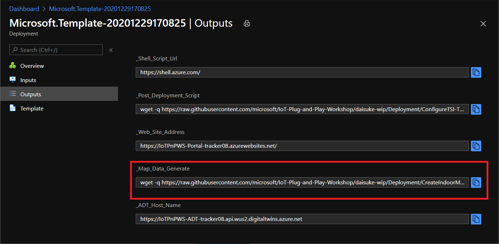
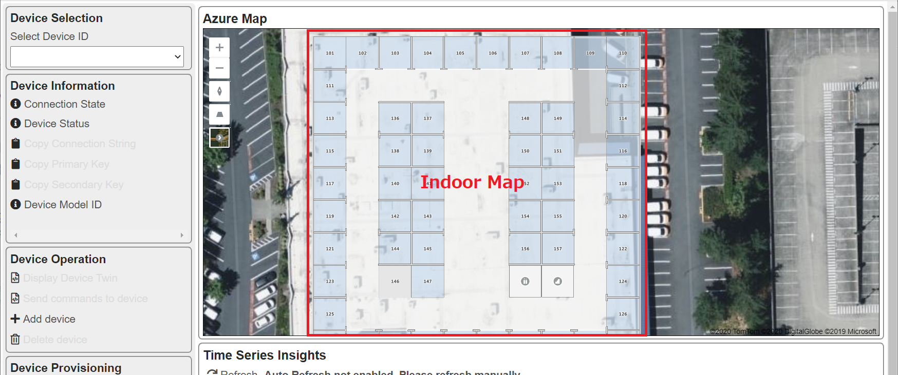

# Adding Indoor Map to Azure Map

## Using Indoor Map

The sample web app is configured to display Indoor Map by providing `Tileset`.   The [Tileset](https://docs.microsoft.com/en-us/azure/azure-maps/creator-indoor-maps#tilesets) is a vector-based representation of a [Map Dataset](https://docs.microsoft.com/en-us/azure/azure-maps/creator-indoor-maps#datasets).
Creating a tileset requires following steps:

1. Upload drawing data such as CAD file
1. Convert the drawing data into indoor map data (dataset)
1. Create a tileset from the dataset

The dataset can have properties (or states) to render features such as different background color using [dynamic styling](https://docs.microsoft.com/en-us/azure/azure-maps/indoor-map-dynamic-styling).

Dynamic styles requires [feature stateset](https://docs.microsoft.com/en-us/azure/azure-maps/creator-indoor-maps#feature-statesets).
Creating feature stateset requires following steps:

1. Upload drawing data such as CAD file
1. Convert the drawing data into indoor map data (dataset)
1. Provide styles based on properties or states, to create stateset

You can find the detailed steps in [CreateIndoorMap.sh](../Deployment/CreateIndoorMap.sh)

## Adding Indoor Map to the sample solution

Take the command from the deployment output `_Map_Data_Generate` and run it in `Cloud Shell`

> [!NOTE]  
> To run the script, run `Bash` in `Cloud Shell`



e.g.

```bash
wget -q https://raw.githubusercontent.com/microsoft/IoT-Plug-and-Play-Workshop/main/Deployment/CreateIndoorMap.ps1 -outfile ./Indoormap.sh && chmod +x ./Indoormap.sh; ./Indoormap.sh 123456789abcdefghijklmnopqrstuvwxyz Tracker08 tracker08 https://iot-plug-and-play-workshop-tracker.azurewebsites.net/api/HOLProgressTracker

```

The script creates Indoor Map dataset, stateset, and featureset.  In addition, the script adds AppSettings to WebApp and Functions app.

Example :

```bash
yourname@Azure:~$ wget -q https://raw.githubusercontent.com/microsoft/IoT-Plug-and-Play-Workshop/main/Deployment/CreateIndoorMap.sh -O ./Indoormap.sh && chmod +x ./Indoormap.sh; ./Indoormap.sh 123456789abcdefghijklmnopqrstuvwxyz Tracker08 tracker08 https://iot-plug-and-play-workshop-tracker.azurewebsites.net/api/HOLProgressTracker
Web App Name   : IoTPnPWS-Portal-demo01
Functions Name : IoTPnPWS-Functions-demo01
Tracker        : Progress Marker 5
Data download  : Start downloading from https://github.com/microsoft/IoT-Plug-and-Play-Workshop-Deploy/raw/main/MapData/Drawing.zip
Data Upload    : URL=https://us.atlas.microsoft.com/mapData/upload?api-version=1.0&dataFormat=zip&subscription-key=w2j75MW6nGHUanazxYDW3pnz8xDFAgwdv151PeBd4gc
Data Upload    : Request Success [202]
Data Upload    : Location https://us.atlas.microsoft.com/mapData/operations/1bb22d75-265a-4b35-8c7d-5edc40b9c7bc?api-version=1.0
    :
Feature State  : Stateset ID 96eece57-2031-8e4e-7ee9-aab3d39b797e
App Settings   : Tileset=            73cdab7f-57f2-ec5b-da2e-532bd7a52874
App Settings   : Stateset=           96eece57-2031-8e4e-7ee9-aab3d39b797e
App Settings   : Dataset=            21263eed-fddf-b055-3a9f-e8e45d5d2cd2
App Settings   : WebApp Tileset=     73cdab7f-57f2-ec5b-da2e-532bd7a52874
App Settings   : WebApp Stateset=    96eece57-2031-8e4e-7ee9-aab3d39b797e
App Settings   : Functions Dataset=  21263eed-fddf-b055-3a9f-e8e45d5d2cd2
App Settings   : Functions Stateset= 96eece57-2031-8e4e-7ee9-aab3d39b797e
Tracker        : Progress Marker 6
```

After the script completes, the sample solutions displays indoor map



## Completed

You created an indoor map data, including tileset and feature set.  The sample IoT Solution uses the tileset and the feature set to display indoor map in the web portal.

### Next Step

[Enabling Azure Digital Twins](AzureDigitalTwins.md)

[Return](../README.md) to the top page