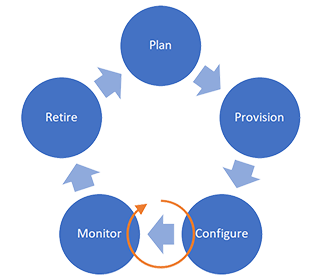

# IoT Device Management

It is important to understand and plan a life cycle of devices to manage devices in an IoT solution.  There is a set of general device management stages that are common to all IoT solutions.  

## Device Lifecyle Stages

There are five stages within the device lifecycle.

### Planing Stage

Plan how to manage devices such as common tasks to perform, settings and properties to monitor, actions to take against devices.

### Provisioning Stage

Register an IoT device to cloud so that the device can communicate with a cloud solution.  Provisioning IoT device to Azure based solution means registering and connecting the device to IoT Hub.  

### Configuring Stage

Once IoT devices are connected to IoT hub, some settings may need to apply to the devices, such as enabling/disabling certain feature, changing some settings, or updating firmware.  Settings varies from device to device so please consult with the manufacturer of the device for appropriate settings.  

### Monitoring Stage

While devices are in use, IoT solution needs to monitor device health, connection status, operation status, and alert errors that may require attention. Additional configuration may require to keep devices in healthy state.

### Retire Stage

When a device reaches its end of lifetime due to upgrade cycle, the end of service lifetime, the device must be removed from the solution.

## Azure IoT Hub

[Azure IoT Hub](https://docs.microsoft.com/en-us/azure/iot-hub/about-iot-hub) is a managed service, hosted in the cloud, that acts as a central message hub for bi-directional communication between your IoT application and the devices it manages. You can use Azure IoT Hub to build IoT solutions with reliable and secure communications between millions of IoT devices and a cloud-hosted solution backend. You can connect virtually any device to IoT Hub.

Azure IoT Hub provides :

- Secure, bi-directional communication
- Device Management

## Azure Device Provisioning Service (DPS)

[Device Provisioning Service](https://docs.microsoft.com/en-us/azure/iot-dps/about-iot-dps) (DPS) is a helper service for IoT Hub that enables zero-touch, just-in-time provisioning to the right IoT hub without requiring human intervention.

Once the IoT device is provisioned to the right IoT Hub, the IoT device can initiate connection to the assigned IoT Hub in secure fashion.

This document covers provisioning and establishing connection to IoT Hub.

## Provisioning IoT Device

In order to add a device to a solution securely, the solution must :

- A solution registers a device identity in DPS through [enrollment](https://docs.microsoft.com/en-us/azure/iot-dps/concepts-service#enrollment)
- DPS validates device identity with [Symmetric Key](https://docs.microsoft.com/en-us/azure/iot-dps/concepts-symmetric-key-attestation), [X.509](https://docs.microsoft.com/en-us/azure/iot-dps/concepts-x509-attestation), and/or [TPM](https://docs.microsoft.com/en-us/azure/iot-dps/concepts-tpm-attestation)
- DPS registers the device identity to IoT Hub
- IoT Hub authenticates the device and accepts a connection request from the device
- IoT Hub configures the device based on settings specified by DPS and/or IoT Hub through Device Twin
- Monitor device health

## Automatic Device Provisioning with DPS

In order to provision a device to an IoT Hub instance, DPS must be enabled both in the solution and in device application/firmware.
Once followings are implemented and configured, end users can simply turn on the device and connect to internet then the device will connect to the solution and data starts flowing in (Zero Touch Provisioning).

### Solution

1. Deploy DPS instance  
    Each deployment receives a unique id called [**ID Scope**](https://docs.microsoft.com/en-us/azure/iot-dps/concepts-service#id-scope)
1. Configure the DPS instance, including [Linked IoT Hub](https://docs.microsoft.com/en-us/azure/iot-dps/concepts-service#linked-iot-hubs) and [allocation policy](https://docs.microsoft.com/en-us/azure/iot-dps/concepts-service#allocation-policy)
1. Create an enrollment, either [**Enrollment Group**](https://docs.microsoft.com/en-us/azure/iot-dps/concepts-service#enrollment-group) or [**Individual Enrollment**](https://docs.microsoft.com/en-us/azure/iot-dps/concepts-service#individual-enrollment), including the attestation mechanism  
    [**Registration ID**](https://docs.microsoft.com/en-us/azure/iot-dps/concepts-service#registration-id) is assigned to each enrollment  

> [!TIP]  
> Open Platform deploys and configures DPS (Step 1 & 2) so that the deployed solution is ready to accept new enrollment. The solution owner is responsible for step 3.

### Device

1. Enable DPS support in the firmware/device app, including embedding Scope ID, Registration ID, and secrets based on the attestation mechanism
1. Connect to IoT Hub using authentication data received from DPS

> [!TIP]  
> DPS support is one of requirements for Azure 

### Solution and Device

Device Identity and attestation mechanism must be configured in both solution and device.  Key points are :

- Registration ID  
    A Registration ID is assigned to each enrollment.  
- Attestation Mechanism
    Symmetric Key, X.509, or TPM

| Attestation   | Registration Id                           | Notes                                   |
|---------------|-------------------------------------------|-----------------------------------------|
| Symmetric Key | Manual                                    | For development and/or small deployment |
| X.509         | From Subject Name (SN) or the certificate | for large deployment                    |
| TPM           | From TPM Chip                             | Requires TPM chip or firmware TPM       |

## Manual Device Provisioning

Instead of provisioning devices with DPS, you may provision IoT devices manually.  Manual provisioning involves following steps :

1. Create a new device identity (Device ID) in IoT Hub
1. Configure a security credential
    - Symmetric Key
    - X.509 certificate

Depending on device types and/or connectivity type (e.g. WiFi vs. LTE), you should use the right authentication method.  Please consult with your device provider for the recommended authentication method(s).

The sample web app provides an example of [Manual Device Provisioning](../Deploy/Deployment.md#send-temperature-from-raspberry-pi-simulator).

### Open Platform Setting Summary

IoT Hub and DPS are deployed and fully configured in the Open Platform as one of [**ready-to-go**](Architecture-Overview.md#open-platform-design-principle) components with following settings.  

| Service | Name              | Setting                      | Notes                                                                             |
|---------|-------------------|------------------------------|-----------------------------------------------------------------------------------|
| DPS     | SKU               | S1                           | $0.123 per 1000 operations                                                        |
| DPS     | Allocation Policy | Evenly Weighted Distribution |                                                                                   |
| IoT Hub | SKU               | S1                           | $25/Month ([Pricing](https://azure.microsoft.com/pricing/details/iot-hub/))       |
| IoT Hub | Message Retention | 1 day                        | how long in days messages are retained by IoT Hub                                 |
| IoT Hub | Partition Count   | 4                            |                                                                                   |
| IoT Hub | Message Routings  | Multiple                     | Please refer to [Data Ingestion Developer Guide](Data-Ingestion-Data-Pipeline.md) |

## Next Steps

- [Deep dive on X.509 Digital Signature](Digial-Signature.md)

[Home](../README.md)