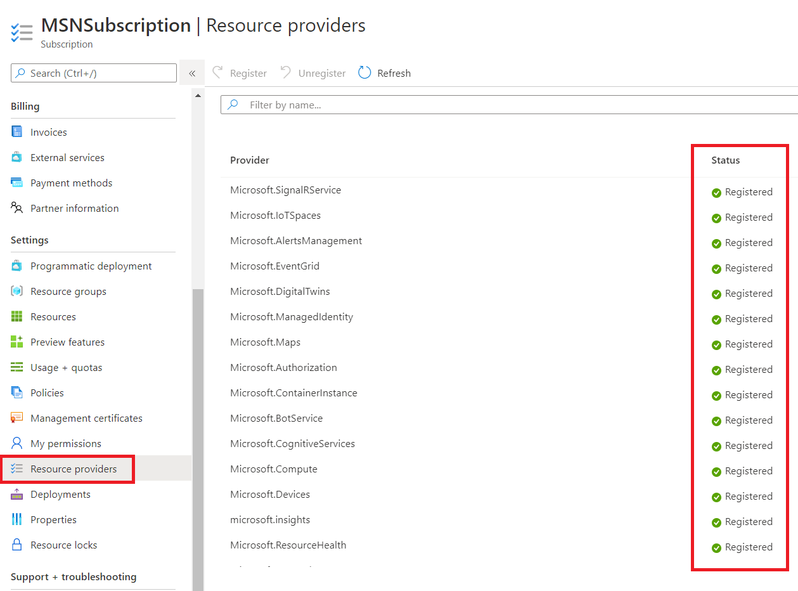

# Registering Azure providers

Some of services are not registered by default.  Therefore, if this is the first time to use such services, you must register their name spaces in your subscription.

## Azure Portal

You can find **Registered** and **Notregistered** providers in the subscription section by navigating `Subscription` -> `Resource Providers` 



To register a provider, select the provider, then click "Register"

## AZ CLI

You may change registration state of providers with AZ CLI **provider** command.

E.g.

```bash
az provider register --namespace 'Microsoft.DigitalTwins'
```

[IoT Plug and Play Technical Workshop](../README.md)