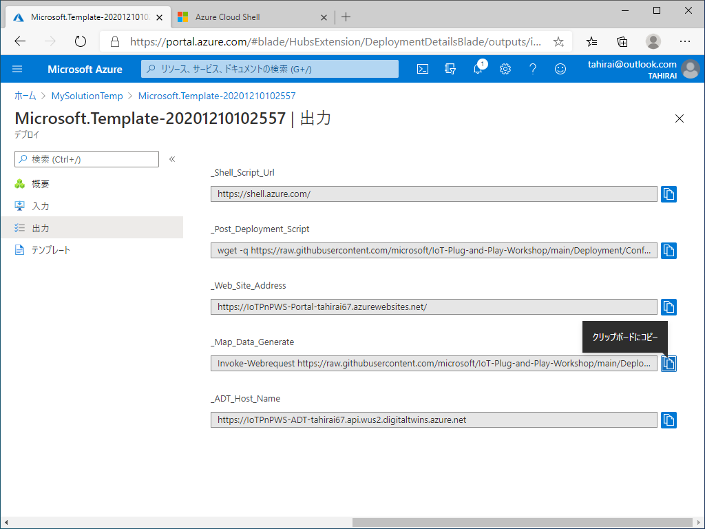
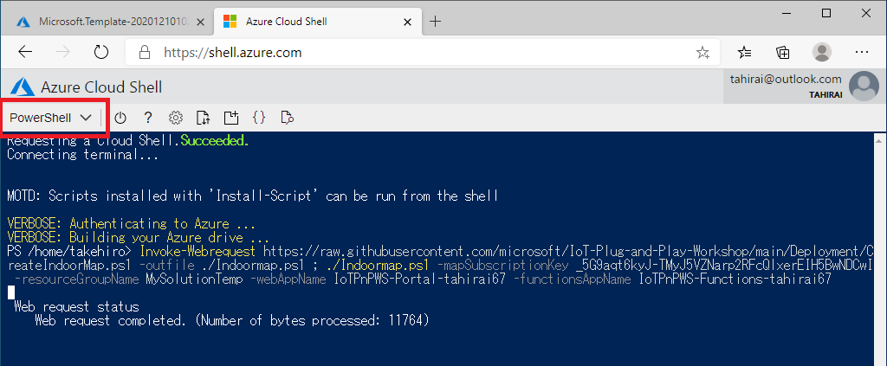
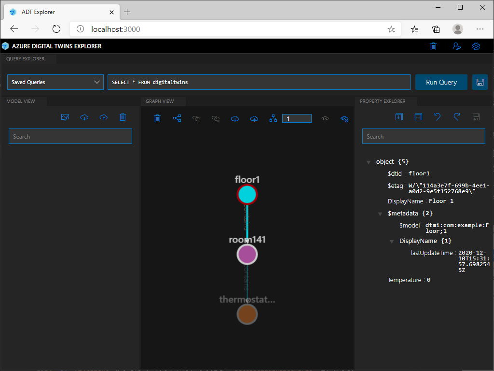

# 準備編 : ADT 環境、サンプル IoT ソリューション の準備

このページでは、PaaS で体験 (応用編) ハンズオンに向けた準備をご説明します

## (事前準備)

> [!IMPORTANT]  
> **(必須/重要) 最初に作業をお願いします**  

- Azure CLI 及び Azure IoT エクステンション のインストール  
<https://docs.microsoft.com/ja-jp/cli/azure/install-azure-cli-windows?tabs=azure-cli>  

  ```bash
  az extension add --name azure-iot  
  ```  

- Node.js のインストール  
<https://nodejs.org/ja/>  
LTS版をインストールしてください (ADT Explorer で用います)  

- ADT Explorer のダウンロード  
<https://github.com/Azure-Samples/digital-twins-explorer/releases/download/235622/Azure_Digital_Twins__ADT__explorer.zip>  
  ダウンロード後、解凍します (例: C:\Azure_Digital_Twins__ADT__explorer)

***  
## ステップ 1. 追加 ARM テンプレート デプロイ  

  1. デプロイを開始する  
  以下の **Deploy to Azure** ボタンをクリックします  

      <a href="https://portal.azure.com/#create/Microsoft.Template/uri/https%3A%2F%2Fraw.githubusercontent.com%2Fmicrosoft%2FIoT-Plug-and-Play-Workshop%2Fmain%2FDeployment%2FCreateADTEventGrid.json" target="_blank"></a>  

      > [!TIPS]  
      > (この文章を参照し続けるため) ボタンを右クリックして **リンクを新しいタブで開く** または **リンクを新しいウィンドウで開く** とするのを推奨します  

        

      > [!NOTE]  
      > `リソースグループ` と `Unique ID` がサンプル IoT ソリューションデプロイ時と同じものになっているかどうかを必ず確認してください (違うものを指定するとエラーになります)  

      `確認および作成` をクリックします  
      検証に成功したのを確認したら、`作成` をクリックします  
      デプロイが完了したのを確認します  

      > [!TIPS]  
      > 今回のデプロイは1分前後で終了します
      
        

## ステップ 2. 地図データ の作成 (Azure Map - Indoor Map)  

1. ブラウザで Azure ポータルにログイン、サンプル IoT ソリューションを展開したリソースグループに移動します  
2. `設定` から `デプロイ` を選択し、昨日行ったデプロイ名をクリックします  
3. 左メニューの `出力` をクリックし、`_Map_Data_Generate` の値をコピーします  

      

4. 新しいブラウザタブ、またはウィンドウを開き、<https://shell.azure.com> に移動します  
    > [!NOTE]  
    > 今回は `Bash` ではなく `PowerShell` を選択します  

    先ほどコピーした値を貼り付け、実行します  
    こちらは完了するのに10分強かかりますので、画面をそのままにして次のステップに進んでください  

      

## ステップ 3. ADT Explorer の設定  

1. PC で `コマンドプロンプト` を開き、Azure にログインします  

    ```bash
    az login
    ```  

    自動的にブラウザが開き、ログインするアカウントを選択する画面になります  
    ここで、サンプル IoT ソリューションをデプロイした時と同じアカウントでログインしてください  
    > [!NOTE]  
    > 1つのアカウントに複数のサブスクリプションが紐付いている場合には、サブスクリプションの選択が必要な場合があります  
    > サンプル IoT ソリューションをデプロイした際のサブスクリプションが選択されているかどうか確認し、それ以外のサブスクリプションが選択されている場合には変更をしてください

    > ```bash  
    >  az account list --output table
    >  az account set --subscription "指定したいサブスクリプション"
    > ```  


2. Zip を解凍したフォルダの `client\src` に移動して、以下のコマンドを実行します  
  (例: C:\Azure_Digital_Twins__ADT__explorer\client\src)  

    ```bash
    npm install  
    npm run start  
    ```  
    標準のブラウザが自動的に立ち上がり、ADT Explorer が表示、`ADT URL` を入力する画面になります  

3. ブラウザで Azure ポータルにログイン、サンプル IoT ソリューションを展開したリソースグループに移動します  
4. `設定` から `デプロイ` を選択し、昨日行ったデプロイ名をクリックします  
5. 左メニューの `出力` をクリックし、`_ADT_Host_Name` の値をコピーします (ADT URL になります)  
6. リソースグループ のトップに戻り、`Azure Digital Twins` のサービスをクリックします  
7. 左メニューの `アクセス制御 (IAM)` をクリック、続いて `ロールの割り当て` をクリックします  
8. `+追加` から `ロールの割り当ての追加` をクリックします  
9. 役割は `Azure Digital Twins 所有者 (プレビュー)` を選択し、選択で Azure ポータルにログインする際に用いたアカウント名を記入、表示されたアカウント をクリック、`保存` をクリックします  
11. ADT Explorer の画面に戻り、先ほどコピーした ADT URL を入力して `Save` をクリックします  

モデルがまだありませんので、`Run Query` しても何も表示されません  

## ステップ 4. ADTClient の実行  

ステップ 2. の最後で実行したスクリプトが終了していないか、`Cloud Shell` の確認してください

1. ブラウザで Azure ポータルにログイン、サンプル IoT ソリューションを展開したリソースグループに移動します  
2. `設定` から `デプロイ` を選択し、昨日行ったデプロイ名をクリックします  
3. 左メニューの `出力` をクリックし、`_ADT_Host_Name` の値をコピーします  

      

4. `Cloud Shell` で以下のコマンドを実行します  

    ```bash
    git clone https://github.com/microsoft/IoT-Plug-and-Play-Workshop.git  
    cd  IoT-Plug-and-Play-Workshop/demo/ADTClient  
    dotnet ./SampleClientApp.dll (_ADT_Host_Name)  
    ```  

5. `ADTClient` が起動してコマンド待ちになったら、`SetupBuildingScenario` と入力します  

6. 処理が終わったのを確認したら、ステップ 3. の ADT Explorer の画面に戻ります  
7. `Run Query` を実行すると `モデル` と `Contains` が作成されているのが確認出来ます  

      

以上で準備は終了です  

  > [!NOTE]  
  > ADTClient はこの後の実践編でも使いますので、そのままにしておいてください  
  > ただし20分でタイムアウトしますのでご注意ください   

[ワークショップ トップページに戻ります](../)  

***