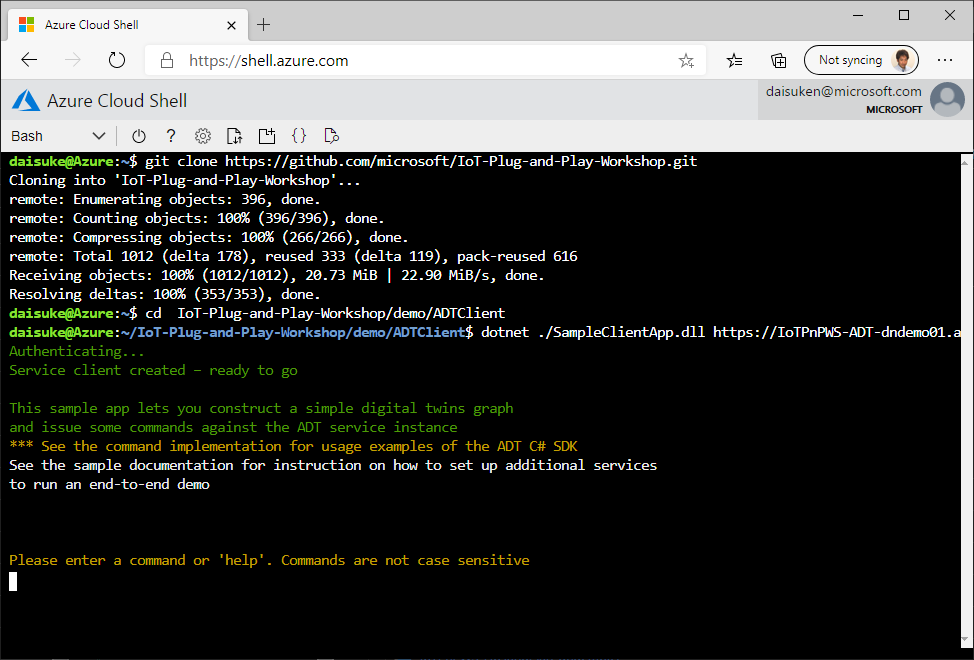
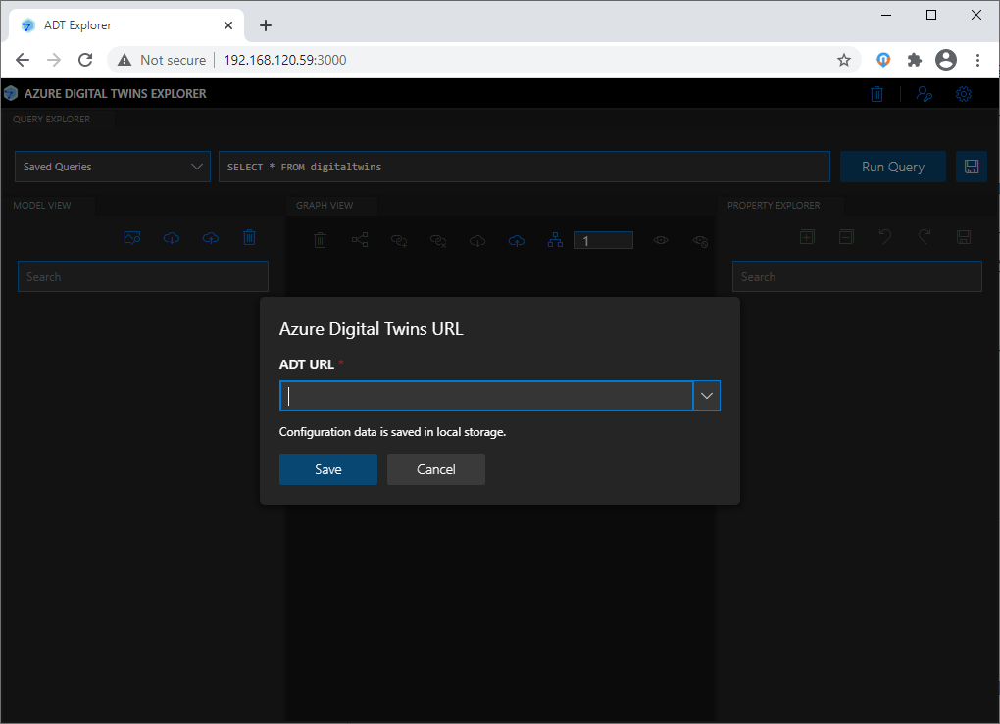

# 準備編 : ADT 環境、サンプル IoT ソリューション の準備

このページでは、PaaS で体験 (応用編) ハンズオンに向けた準備をご説明します

## (事前準備)

> [!IMPORTANT]  
> **(必須/重要) 最初に作業をお願いします**  

- Azure CLI 及び Azure IoT エクステンション のインストール  
<https://docs.microsoft.com/ja-jp/cli/azure/install-azure-cli-windows?tabs=azure-cli>  

  ```bash
  az extension add --name azure-iot  
  ```  

- Node.js のインストール  
<https://nodejs.org/ja/>  
LTS版をインストールしてください (ADT Explorer で用います)  

- ADT Explorer のダウンロード  
<https://github.com/Azure-Samples/digital-twins-explorer/releases/download/235622/Azure_Digital_Twins__ADT__explorer.zip>  
  ダウンロード後、解凍します (例: C:\Azure_Digital_Twins__ADT__explorer)

***  

## ステップ 1. 地図データ の作成 (Azure Map - Indoor Map)  

Azure Map にインドアマップのデータを追加します。この処理には 10 分ほどかかりますので、最初に行っておきます。

インドアマップの作成には CAD データを基に、ビルディング、フロア、ルームなどの地図データを作成します。
これらの一連の作業をスクリプト化しましたので、クラウドシェルにで実行します。

> [!TIP]  
> ローカルのパワーシェルでの実行も可能です。

1. ブラウザで Azure ポータルにログイン、サンプル IoT ソリューションを展開したリソースグループに移動します  
1. `設定` から `デプロイ` を選択し、昨日行ったデプロイ名をクリックします  
1. 左メニューの `出力` をクリックし、`_Map_Data_Generate` の値をコピーします  

      

1. 新しいブラウザタブ、またはウィンドウを開き、<https://shell.azure.com> に移動します  

    > [!NOTE]  
    > 今回は `Bash` ではなく `PowerShell` を選択します  

    先ほどコピーした値を貼り付け、実行します  
    こちらは完了するのに10分強かかりますので、画面をそのままにして次のステップに進んでください  

      

## ステップ 2 : アクセス権の追加

Azure デジタルツインに接続し、モデル・ノードの作成や参照をするためにアクセス権の追加を行います。

1. ブラウザで Azure ポータルにログイン、サンプル IoT ソリューションを展開したリソースグループに移動します  
1. `設定` から `デプロイ` を選択し、昨日行ったデプロイ名をクリックします  
1. 左メニューの `出力` をクリックし、`_ADT_Host_Name` の値をコピーします (ADT URL になります)  
1. リソースグループ のトップに戻り、`Azure Digital Twins` のサービスをクリックします  

    例：**IoTPnPWS-ADT-<指定したID>**

1. 左メニューの `アクセス制御 (IAM)` をクリック、続いて `ロールの割り当て` をクリックします  
1. `+追加` から `ロールの割り当ての追加` をクリックします  
1. 役割は `Azure Digital Twins 所有者 (プレビュー)` を選択し、選択で Azure ポータルにログインする際に用いたアカウント名 (メールアドレス）を記入、表示されたアカウント をクリック、`保存` をクリックします  

## ステップ 3 : デジタルツインツールの準備

Azure デジタルツインにアクセスし、データを確認したり、モデルを登録するためのツールを準備します。

### ステップ 3.1 : コマンドラインツール : ADT クライアント

.net core 3.1 ベースのコマンドラインツール。Azure Digital Twin API を使用してデジタルツインのインスタンスにアクセスします。

1. ブラウザで Azure ポータルにログイン、サンプル IoT ソリューションを展開したリソースグループに移動します  
1. `設定` から `デプロイ` を選択し、昨日行ったデプロイ名をクリックします  
1. 左メニューの `出力` をクリックし、`_ADT_Host_Name` の値をコピーします  

      

1. `Cloud Shell` で以下のコマンドを実行します  

    ```bash
    git clone https://github.com/microsoft/IoT-Plug-and-Play-Workshop.git  
    cd  IoT-Plug-and-Play-Workshop/demo/ADTClient  
    dotnet ./SampleClientApp.dll <コピーした _ADT_Host_Name >  
    ```  

    実行例 :  

      

    > [!TIP]  
    > クラウドシェルは 20 分間操作しないとタイムアウトしますので、ご注意ください。
    > タイムアウトしてしまった場合には再接続し、上記の ADT Client を再度起動してください。

1. `ADTClient` が起動してコマンド待ちになったら、`GetModels` と入力しアクセス権の問題がないか確認します。  

    実行例

    ```bash
    getmodels
    Submitting...
    
    Found 0 model(s)
    
    Please enter a command or 'help'. Commands are not case sensitive
    ```

### ステップ 3.2 : GUI ツール : ADT Explorer

node.js ベースの GUI ツール。ブラウザーを使用してデジタルツインのデータにアクセスし可視化します。

1. PC で `コマンドプロンプト` を開き Node.js が動作していることを確認します。  

    ```bash
    C:\>node --version
    v14.15.1
    
    C:\>npm --version
    6.14.8
    ```

    > [!IMPORTANT]
    > Node.js のバージョンが 12 以上であることが必要です。

1. コマンドプロントから、Azure にログインします  

    ```bash
    az login
    ```  

    自動的にブラウザが開き、ログインするアカウントを選択する画面になります  
    ここで、サンプル IoT ソリューションをデプロイした時と同じアカウントでログインしてください  

    > [!NOTE]  
    > 1つのアカウントに複数のサブスクリプションが紐付いている場合には、サブスクリプションの選択が必要な場合があります  
    > サンプル IoT ソリューションをデプロイした際のサブスクリプションが選択されているかどうか確認し、それ以外のサブスクリプションが選択されている場合には変更をしてください
    >
    > ```bash  
    >  az account list --output table
    >  az account set --subscription "指定したいサブスクリプション"
    > ```  

1. アプリケーションをダウンロードします  

    ダウンロードリンク :  <https://github.com/Azure-Samples/digital-twins-explorer/releases/download/235622/Azure_Digital_Twins__ADT__explorer.zip>

1. ダウンロードした Zip ファイルを解凍します

1. コマンドプロンプトで、解凍先フォルダの `client\src` に移動して、アプリケーションの初期化をします  

    例: C:\Azure_Digital_Twins__ADT__explorer に解凍した場合

    ```bash
    cd C:\Azure_Digital_Twins__ADT__explorer\client\src
    npm install  
    ```  

1. 初期化が終了したらアプリケーションを実行します  

    ```bash
    npm run start  
    ```

    標準のブラウザが自動的に立ち上がり、ADT Explorer が表示、`ADT URL` を入力する画面になります  

    

1. ブラウザで Azure ポータルにログイン、サンプル IoT ソリューションを展開したリソースグループに移動します  
1. `設定` から `デプロイ` を選択し、昨日行ったデプロイ名をクリックします  
1. 左メニューの `出力` をクリックし、`_ADT_Host_Name` の値をコピーします (ADT URL になります)  
1. ADT Explorer の画面に戻り、先ほどコピーした ADT URL を入力して `Save` をクリックします  
1. `Run Query` ボタンを押してアクセス権の問題がないか確認します  

    モデルがまだありませんので、`Run Query` しても何も表示されませんが、正常にアクセスできていない場合にはその旨の内容のエラーが表示されます。

[ワークショップ トップページに戻ります](../)  

***
