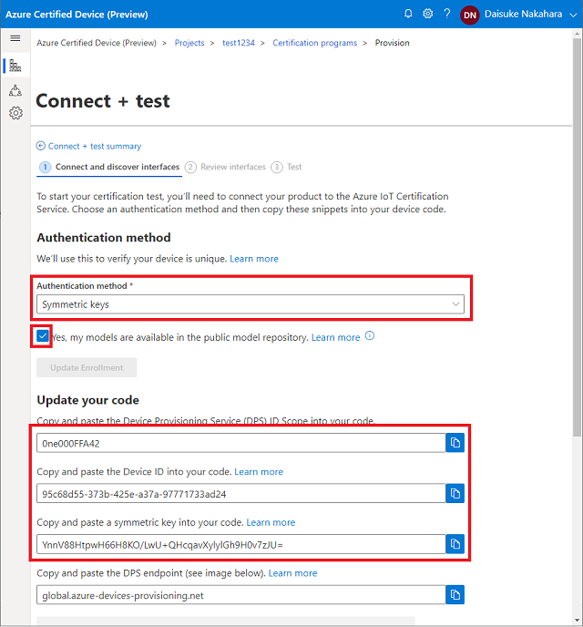
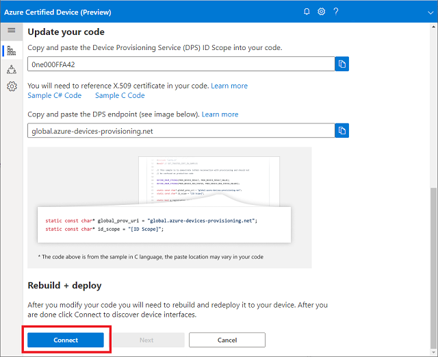
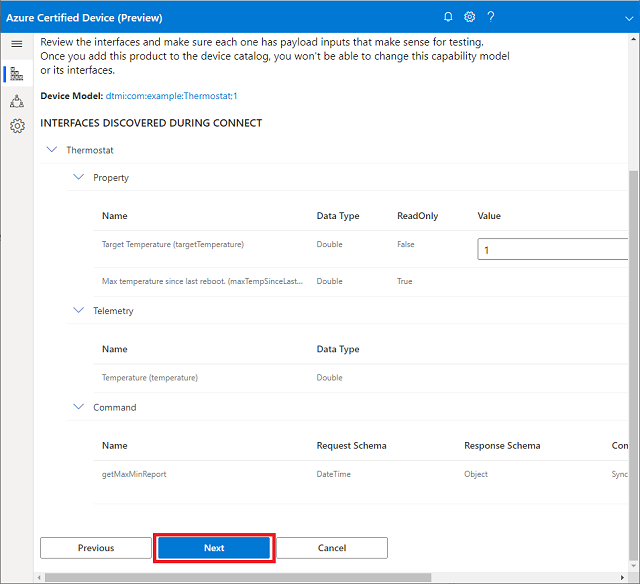

# IoT Plug and Play デバイス シミュレーター (温度計)

このドキュメントでは、[Thermostat Device Model](https://github.com/Azure/iot-plugandplay-models/blob/main/dtmi/com/example/thermostat-1.json) と連携して動作するシミュレーター (コード) の展開方法を説明します

特徴は以下の通りです  
- サンプル IoT ソリューション ハンズオン対応  
- IoT Plug and Play 認証デモ対応  
- 対称鍵、及び X.509 証明書認証をサポート  

## 開発環境をセットアップ  
Windows 10 環境を想定しています

### 要件

- Linux 環境  
    - Windows Subsystem for Linux (WSL) ( [Ubuntu 18.04 LTS](https://www.microsoft.com/ja-jp/p/ubuntu-1804-lts/9n9tngvndl3q) でテスト済 )  
- ツールチェーン   
以下の [手順](#install-pre-requisite) に沿って必要なツールとライブラリをインストールしてください

### 環境の事前構築
1. WSL(2) のインストール
    1. *スタートボタン* で右クリック、**Windows Power Shell (管理者)** をクリックします  
    以下のコマンドを順番に実行します  
        ``` Windows Power Shell
        dism.exe /online /enable-feature /featurename:Microsoft-Windows-Subsystem-Linux /all /norestart  

        dism.exe /online /enable-feature /featurename:VirtualMachinePlatform /all /norestart  
        ```
        実行後、PCを再起動します
    1. WSL2 Linux カーネル更新プログラムを適用します  
    http://aka.ms/wsl2kernelmsix64  
    からダウンロード、実行します  
    1. 再度 **Windows Power Shell (管理者)** をクリックします  
    以下のコマンドを実行します  
        ``` Windows Power Shell
        wsl --set-default-version 2   
        ```
    1. Microsoft Store から Ubuntu イメージをインストールします  
    [Ubuntu 18.04 LTS](https://www.microsoft.com/ja-jp/p/ubuntu-1804-lts/9n9tngvndl3q) にアクセス、**入手** をクリックします  
    Microsoft Store アプリが立ち上がりますので、再度 **入手** をクリックします  
    Microsoft アカウントでログインしていない場合は、サインインが促されます  
    (サインインは必須ではありませんので、*必要ありません* でスキップでも構いません)  

    1. インストールが完了したら **起動** をクリックします  
    UNIX ユーザーアカウントの設定が求められますので、任意に入力します  
    (Windows のユーザーとは関連性ありません)  
    Ubuntu 18.04 LTS が起動します  

1. 必要なツールとライブラリをインストールします
    ```bash
    sudo apt-get update && \
    sudo apt-get install -y git cmake build-essential curl libcurl4-openssl-dev libssl-dev uuid-dev
    ```  
1. このレポジトリを Clone します
    ```bash
    git clone https://github.com/microsoft/IoT-Plug-and-Play-Workshop.git && \
    cd IoT-Plug-and-Play-Workshop/demo/SimpleThermostat/script/
    ```  
1. セットアップスクリプト (内容は以下の通り) を実行します  
    - Azure IoT C Device SDK をクローン  
    - セルフサインの X.509 証明書を生成  
    - 温度計 シミュレーター アプリをビルド  

    ```bash
    ./setup.sh
    ```

    > [!TIP]  
    > setup.sh は以下のオプションに対応しています  
    >
    > ```bash
    > Usage: ./setup.sh [-c] [-r] [-v] [-h]
    >  -c : (C)lean up environment.  Deletes Azure IoT SDK C and other folders and files
    >  -r : (R)e-create new X509 certificates
    >  -v : (V)erbose
    >  -h : (H)elp menu
    >```

## 温度計 シミュレーター アプリの利用  

1. 実行用シェルスクリプトを任意のテキストエディタで開きます  
    ```bash
    nano run.sh  
    ```
1. DPS Scope ID、Device ID、対称鍵を入力して保存します
    ```bash
    # export DPS_X509=1
    unset DPS_X509
    export DPS_IDSCOPE='0ne001D591B'
    export DPS_DEVICE_ID='simtemp'
    export DPS_SYMMETRIC_KEY='3j+Vi2CtCidXQijTc/zYX8bHQbcE1vVN/LIgCWtJT8Q='
    ```  
1. スクリプトを実行します
    ```bash
    ./run.sh  
    ```

    以下はこのアプリを用いた Azure Certified Device ポータル手順デモです  

## 新しいプロジェクトを Azure Certified Device ポータルで作成する

1. [Azure Certified Device Portal](https://certify.azure.com) にアクセスします
1. **+ 新しいプロジェクトの作成** をクリックします  
    > プロジェクト名:    
    > デバイス名:  
    > デバイスの種類:  
    > デバイスクラス:  

    を入力し、**次へ** をクリックします  

1. 有効にする認定を選択します  
    > Azure Certified Device  
    > IoT プラグアンドプレイ  

    を選択し、**作成** をクリックします  

1. 作成したプロジェクトを選択します  
    **接続とテスト** をクリックします  

    **テストの実行>** をクリックします  

### テスト手順  
認証情報として、*対称キー* または *X.509 証明書* が利用可能です  

1. *対称キー* で行う場合
    1. 認証方法を選択します (*対称キー* を選択)  
    1. *はい、モデルはパブリック モデル レポジトリで使用できます* にチェックを入れます  
    1. **登録の追加** をクリックします
    1. *コードの更新* に表示された項目を ./run.sh に反映します
        > デバイス プロビジョニング サービス (DPS) ID スコープのコピーとコードへの貼り付け  
        > デバイス ID のコピーとコードへの貼り付け  
        > 対称キーのコピーとコードへの貼り付け  

    1. ./run.sh を実行します  
    1. **接続** をクリックします  

1. *X.509 証明書* で行う場合  
    1. 認証方法を選択します (*X.509 証明書* を選択)  
    1. X.509 証明書ファイル の **ファイル選択** をクリックします  
    *IoT-Plug-and-Play-Workshop\demo\SimpleThermostat\cmake\certs* の  
    *(マシン名).cer.pem*  
    を選択します  
        > [!TIP]  
        > WSL2 上のファイルは エクスプローラーからアクセス可能です  
        > エクスプローラーのパスに *\\\wsl$* を入力してください  
    1. *はい、モデルはパブリック モデル レポジトリで使用できます*  にチェックを入れます
    1. *コードの更新* に表示された項目を ./run.sh に反映します
        > デバイス プロビジョニング サービス (DPS) ID スコープのコピーとコードへの貼り付け  

        > [!NOTE]  
        > X.509 証明書を用いる場合は、  
        > export DPS_X509=1  
        > がコメントアウト(行の最初に#)されていないことを確認してください  

    1. **登録の追加** をクリックします
    1. ./run.sh を実行します
    1. **接続** をクリックします

これ以降は対称キー、X.509 証明書で共通です  

1. **次へ** をクリックします  
1. **次へ** をクリックします  
1. **テストの実行** をクリックします  
    テストの状態 において、
    *成功しました。[完了] をクリックして次の手順に進んでください*  
    と表示されたら完了です  

### X.509 Certificate


1. Browse to Azure Certified Device portal
1. Create a new project
1. Select `Connect + test`
1. Click `Run tests` for IoT Plug and Play
1. Upload `./cmake/new-device.cert.pem` to the portal, then click `Add Enrollment`
1. Select the checkbox saying `Yes, my models are available in the public model repository.`
1. Click `Add Enrollment`
1. `set` DPS_IDSCOPE to the ID Scope provided by the portal
1. `Set` DPS_X509 (or remove/comment out `unset DPS_X509`)

    Example :

    ```bash
    # Set ID Scope for DPS
    export DPS_IDSCOPE='0ne000FFA42'

    # Detemines type of DPS attestation
    # set DPS_X509 for X.509
    # unset DPS_X509 for Symmetric Key
    export DPS_X509=1
    # unset DPS_X509

    # for Symmetric Key Provisioning
    # Get Device ID and Symmetric Key from the certification portal
    export DPS_DEVICE_ID=''
    export DPS_SYMMETRIC_KEY=''
    ```

### Symmetric Key



1. Browse to Azure Certified Device portal
1. Create a new project
1. Select `Connect + test`
1. Click `Run tests` for IoT Plug and Play
1. Select `Symmetric Keys` for Authentication method
1. Select the checkbox saying `Yes, my models are available in the public model repository.`
1. Click `Add Enrollment`
1. Open ./run.sh with your favorite text editor
1. `set` DPS_IDSCOPE to the ID Scope provided by the portal
1. `unset` DPS_X509
1. `set` DPS_DEVICE_ID and DPS_SYMMETRIC_KEY

    Example :

    ```bash
    # Set ID Scope for DPS
    export DPS_IDSCOPE='0ne000FFA42'

    # Detemines type of DPS attestation
    # set DPS_X509 for X.509
    # unset DPS_X509 for Symmetric Key
    export DPS_X509=1
    unset DPS_X509

    # for Symmetric Key Provisioning
    # Get Device ID and Symmetric Key from the certification portal
    export DPS_DEVICE_ID='8cfea9d9-3844-4e62-b6cc-c6be324453df'
    export DPS_SYMMETRIC_KEY='dw88wVI0yd2E86cwN+PkczUNhDG4tGRPT2GwphsQJnE='
    ```

## Running the demo

1. Run the app with  

    ```bash
    ./run.sh
    ```

1. Confirm the device is provisioned to IoT Hub

    Example :

    ```bash
    =======================================================
    Info: Common Name : IoTPnPCertDemoX_15945
    Info: Provisioning Status: PROV_DEVICE_REG_STATUS_CONNECTED
    Info: Provisioning Status: PROV_DEVICE_REG_STATUS_ASSIGNING
    Info: Registration Information received from DPS
    Info: IoT Hub     : certsvc-hub-prod-westus2.azure-devices.net
    Info: Device Id   : IoTPnPCertDemoX_15945
    Info: Connecting to IoT Hub
    =======================================================
    Reading X.509 Certificate
    Issuer     : /CN=Azure IoT Hub CA Cert Test Only
    Subject    : /CN=IoTPnPCertDemoX_15945
    =======================================================
    Info: IoTHubDeviceClient_LL_CreateFromDeviceAuth Success
    Info: Connected to iothub : certsvc-hub-prod-westus2.azure-devices.net
    ```

1. Continue the certification test by clicking `Connect` button

    

1. Confirm that the portal should find the device, then click `Next`

    

1. The simulator does not require any parameter changes.  Click `Next` 

    

1. Start automated test by clicking `Run tests`

    

1. In a few minutes, the test should complete with `Pass` status

    
