# Wio Terminal と Azure IoT Central で IoT PnP を体感する
このハンズオンラボでは、以下のことを体験します :

- Azure IoT Central でアプリケーションを作成  
- Wio Terminal + IoT PnP 無しで Azure IoT Central に接続する  
- Wio Terminal + IoT PnP で Azure IoT Central に接続する  

## 必須
- Azure サブスクリプション  
    もし Azure Subscription をお持ちでない場合には、無償で作成が可能です (1年間有効)  
    <https://azure.microsoft.com/free/>  
- Windows 10 搭載 PC  
    - WEB ブラウザ (Microsoft Edge など)  
    <https://www.microsoft.com/ja-jp/edge>
    - Tera Term (Wio Terminal とのシリアル接続時に利用します)  
    <https://ja.osdn.net/projects/ttssh2/>

## 1. Azure IoT Central でアプリケーションを作成する
1. 以下の URL をクリックして Azure IoT Central を開きます  
<https://apps.azureiotcentral.com/>
    
2. 画面をスクロールさせ **カスタムアプリを作成する** をクリックします  
いくつかの項目を入力する必要がありますので、以下を参考にしてください  
    - アプリケーション名 : Wio Terminal  
    - URL : wio-terminal-1234  
    (Azure IoT Central 全体で一意である必要があります)  
    - アプリケーション テンプレート : カスタムアプリケーション  
    - 料金プラン : Standard 2  
    - ディレクトリ : (複数見える場合は、今回用いるサブスクリプションが含まれるもの)  
    - Azure サブスクリプション : (今回用いるもの)
    - 場所 : 日本  
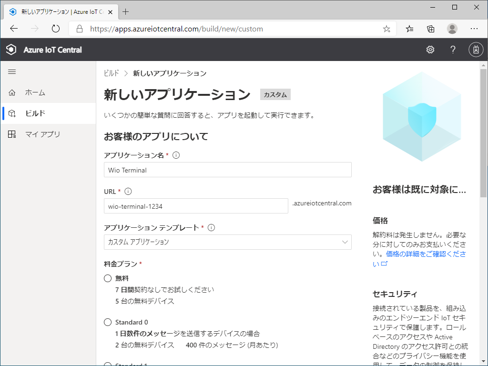  
以上を入力後、**作成** をクリックすると、アプリケーションがプロビジョニングされます  

## 2. Wio Terminal の Wi-Fi 接続を設定する
> [!NOTE]  
> Wio Terminal ご購入直後は、まず Wi-Fi のファームウェア更新が必要です  
> その具体的な手順については、以下の URL を参照してください
> 
> 今回は、出荷前に 2.0.3 JP を適用済みですので、手順スキップ可能です

まず Wio Terminal を Configuration Mode (設定モード) で起動します  

1. Wio Terminal の本体上部にある3つのボタンを押さえながら、PC に接続する  
成功すると LCD に *In configuration mode* と表示されます  
2. デバイスマネージャで Wio Terminal の COM ポートを確認する  
この画面の場合は *USB シリアルデバイス (COM7)* がそれです
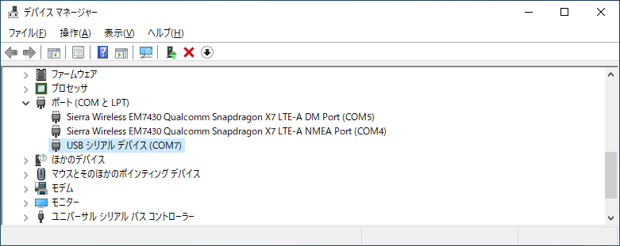
3. Tera Term を実行し、**Serial** をクリック、先ほど確認した COM ポートを選択、**OK** をクリックします

4. *help* とタイプし、設定メニューを表示します  
5. Wi-Fi SSID と パスワードを入力します  
*set_wifissid (設定したいSSID)*  
*set_wifipwd (設定したいパスワード)*  
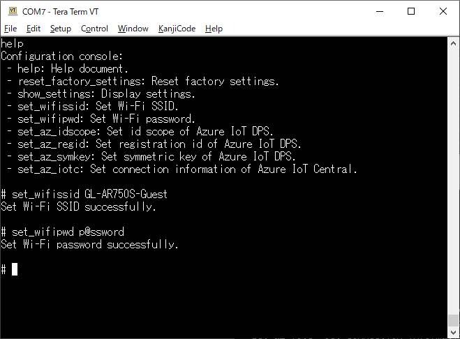  
この後もう一度このターミナルを使いますので、開いたままにします

## 3. Azure IoT Central アプリケーションからデバイス接続用の情報を入手する
1. 左メニューの **管理** - **デバイス接続** をクリックします  
表示される *ID スコープ* をメモ帳などに控えます  
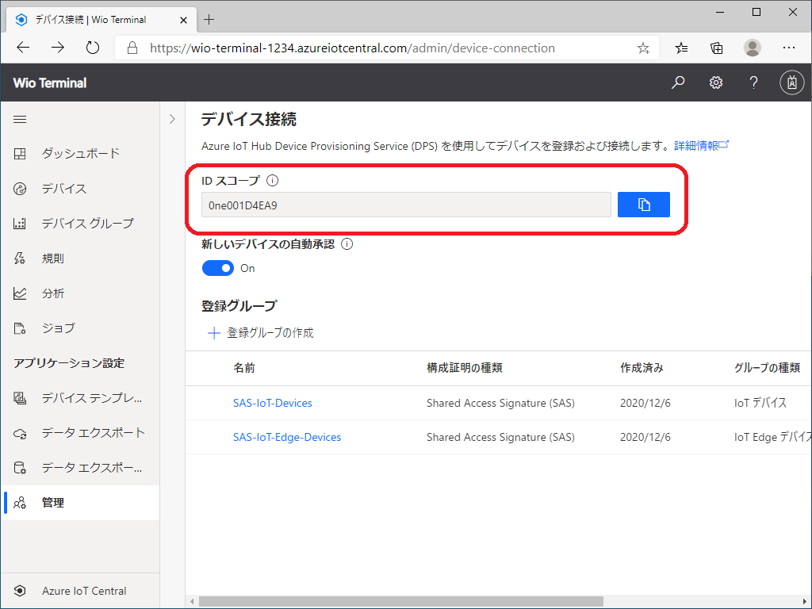
2. **SAS-IoT-Devices** をクリックします  
表示される *主キー* をメモ帳などに控えます
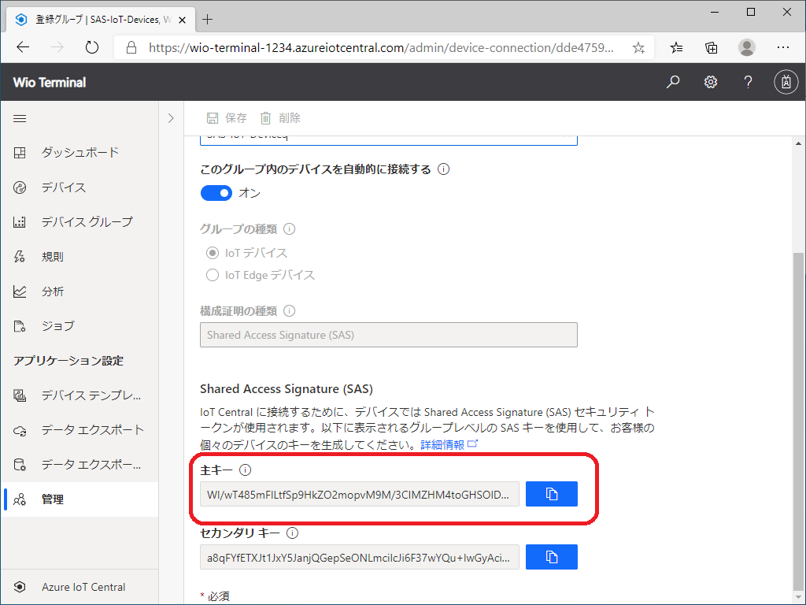

> [!TIP]  
> それぞれ値の右のボタンをクリックするとコピーされます

## 4. Wio Terminal に Azure IoT Central 接続設定を書き込む  
TeraTerm の画面に戻って Azure IoT Central の接続情報を書き込みます  
*set_az_iotc (スコープID) (主キー) (デバイスID)*  
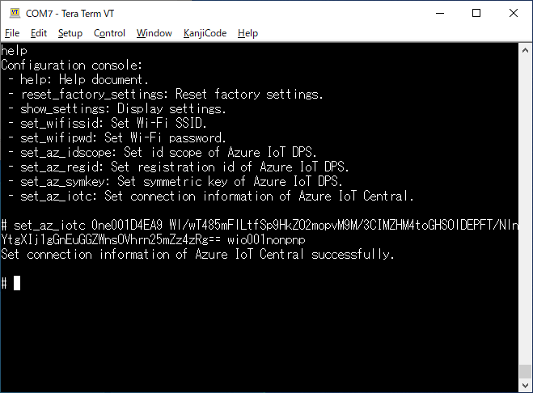
> [!TIP]  
> デバイスIDは一意である必要があります (例: *wio001nonpnp* など)  

書き込み後、TeraTerm を閉じます  

## 5. Wio Terminal に Non-PnP 版のアプリを書き込む  
Wio Terminal を アプリケーション書き込みモード で起動します  

1. Wio Terminal の本体左部にあるスライドスイッチを素早く2回下げる  
成功すると、PC のエクスプローラに *Arduino* という名前のドライブが表示されます  
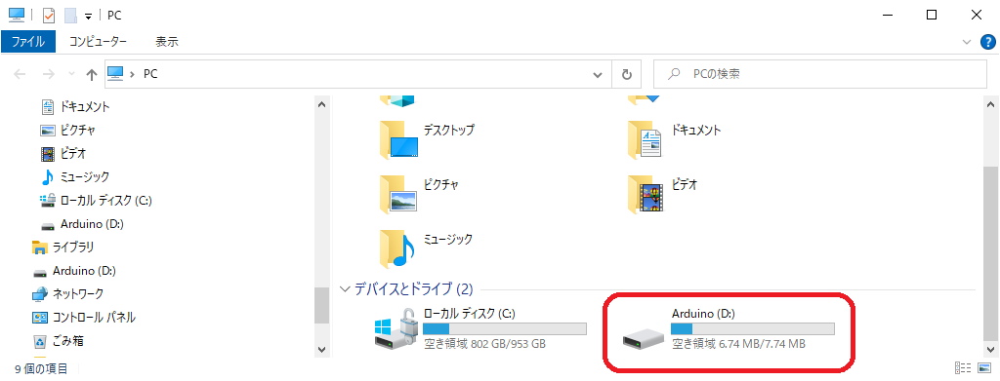

2. *Arduino* ドライブに *NonPnP.bin* をドラッグ＆ドロップします  
書き込みに成功すると、Wio Terminal が自動的に再起動、アプリケーションが開始します  

## 6. Azure IoT Central でデバイス登録を確認する
1. 左メニューの **デバイス** をクリックします
Wio Terminal が Azure IoT Central 内の DPS を通じてデバイス登録されているのが確認出来ます
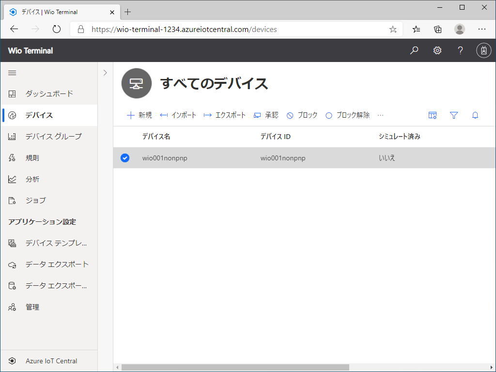
テレメトリーも Azure IoT Central に流れてきていますが、Azure IoT Central はどのようなデータが流れてきているか理解出来ないため、可視化等を行うことが出来ません  

この状態が、IoT Plug and Play の無い世界における一般的な状況です  

## EXTRA-1. デバイステンプレートを作成して可視化する
先ほどご覧いただいた動画にもあった通り、デバイステンプレートを手動にて作成いただければ、可視化等を行うことが出来ます  
ご興味あればお試しください  

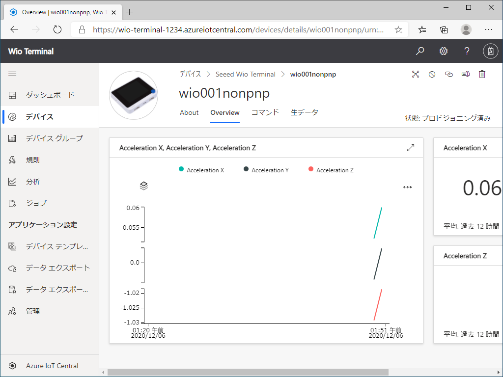

## 7. IoT PnP 版を別デバイスとして登録するための設定を書き込む
1. Wio Terminal の本体上部にある3つのボタンを押さえながら、PC に接続する  
2. TeraTerm で Azure IoT Central の接続情報を書き込みます  
*set_az_iotc (スコープID) (主キー) (デバイスID)*  
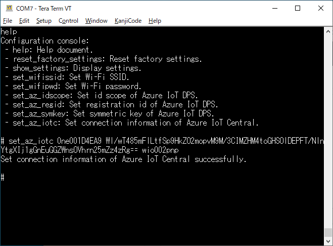
> [!TIP]  
> デバイスIDは先ほどと違うものを指定します (例: *wio002pnp* など)  

書き込み後、TeraTerm を閉じます  

## 8. Wio Terminal に IoT PnP 版のアプリを書き込む
Wio Terminal を アプリケーション書き込みモード で起動します  

1. Wio Terminal の本体左部にあるスライドスイッチを素早く2回下げる  
成功すると、PC のエクスプローラに *Arduino* という名前のドライブが表示されます  

2. *Arduino* ドライブに *PnP.bin* をドラッグ＆ドロップします  
書き込みに成功すると、Wio Terminal が自動的に再起動、アプリケーションが開始します

## 9. Azure IoT Central でデバイス登録を確認する
1. 左メニューの **デバイス** をクリックします  
Wio Terminal が Azure IoT Central 内の DPS を通じてデバイス登録されているのが確認出来ます  
ただし、先ほどと異なり*デバイス名*がクリック出来ます(デバイステンプレートが自動で適用されています)  
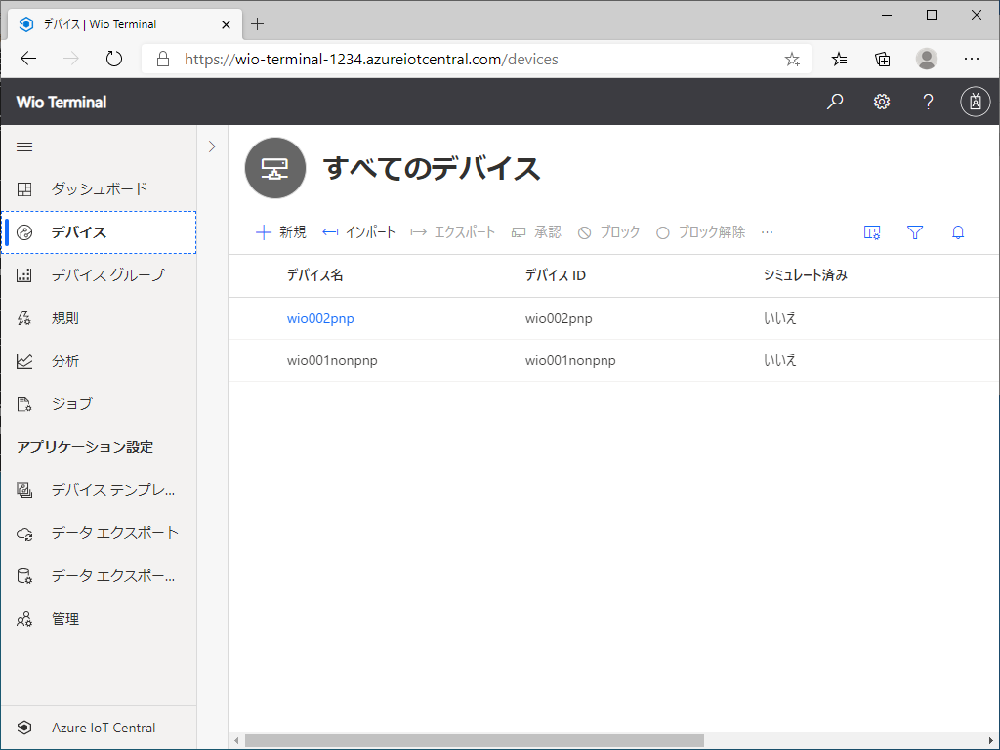  

2. *デバイス名* (画面では *wio002pnp*) をクリックします　　
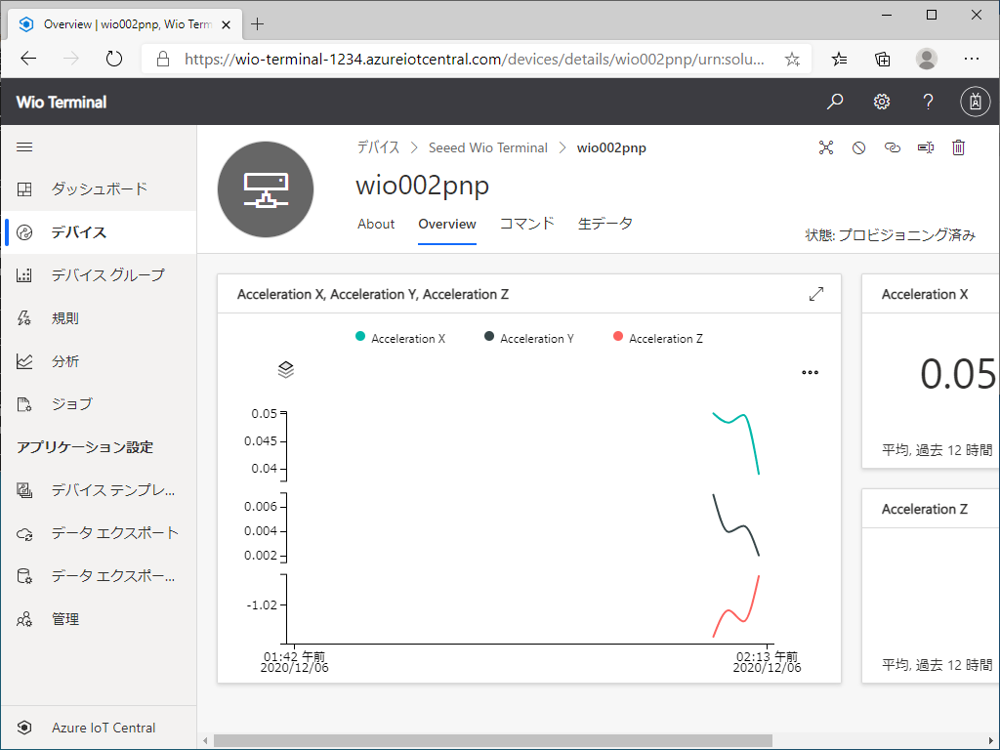  
テレメトリーを受け取り、可視化が始まっているのが確認できます  
これが IoT Plug and Play と IoT Plug and Play に対応した Azure IoT Central が実現する世界です  

## EXTRA-2. 光センサーに追加対応した Wio Terminal + IoT PnP を試す  
Seeed Japan 松岡様のご厚意で、Wio Terminal 内蔵の光センサーを有効にしたアプリケーションをご用意いただきました  
このアプリケーションは、光センサーが出力する内容に対応したデバイスモデルを参照します  
デバイスに機能拡張を行う場合を想像し、ここまでの一連の手続きに沿って試してみてください  

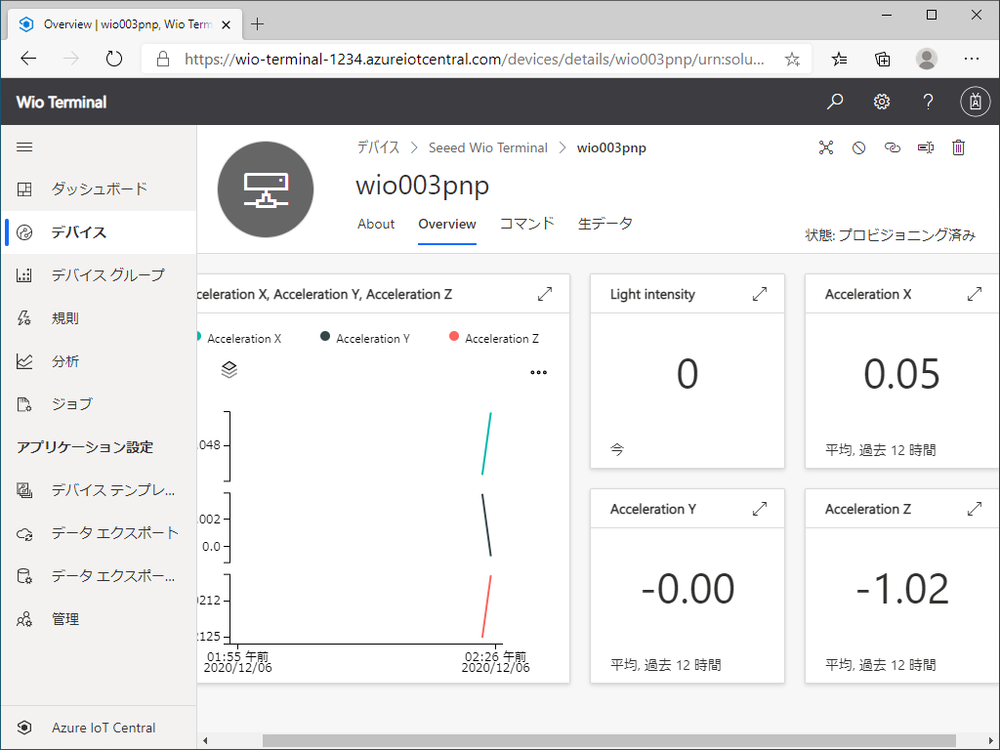  

## 参考URL :
Azure Certified Device Catalog : 
<https://devicecatalog.azure.com/>  
Azure IoT Central : 
<https://aka.ms/iotcentral>  
Seeed Wio Terminal : <https://www.seeedstudio.com/Wio-Terminal-p-4509.html>  
SeeedJP / wioterminal-aziot-example : <https://github.com/SeeedJP/wioterminal-aziot-example/releases>  
