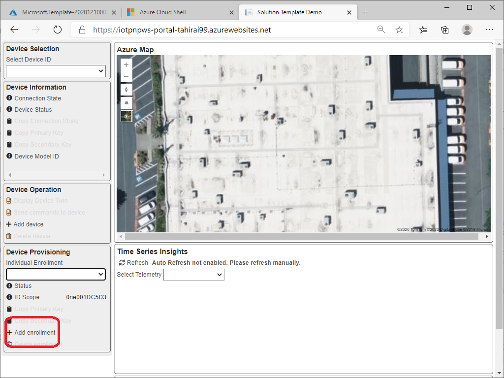
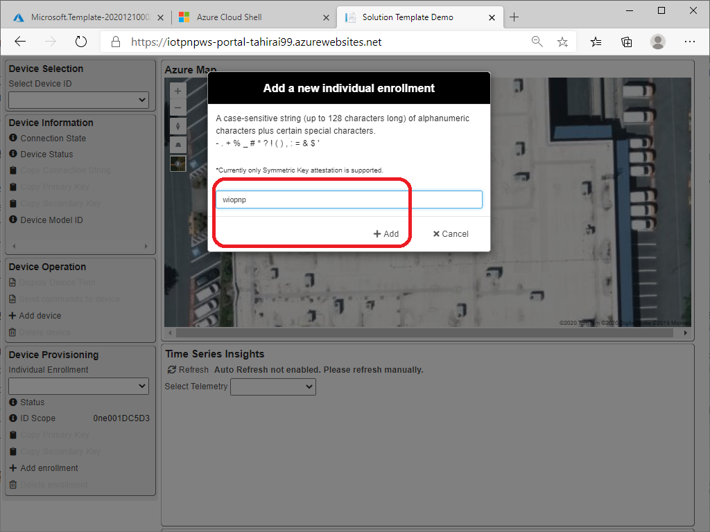
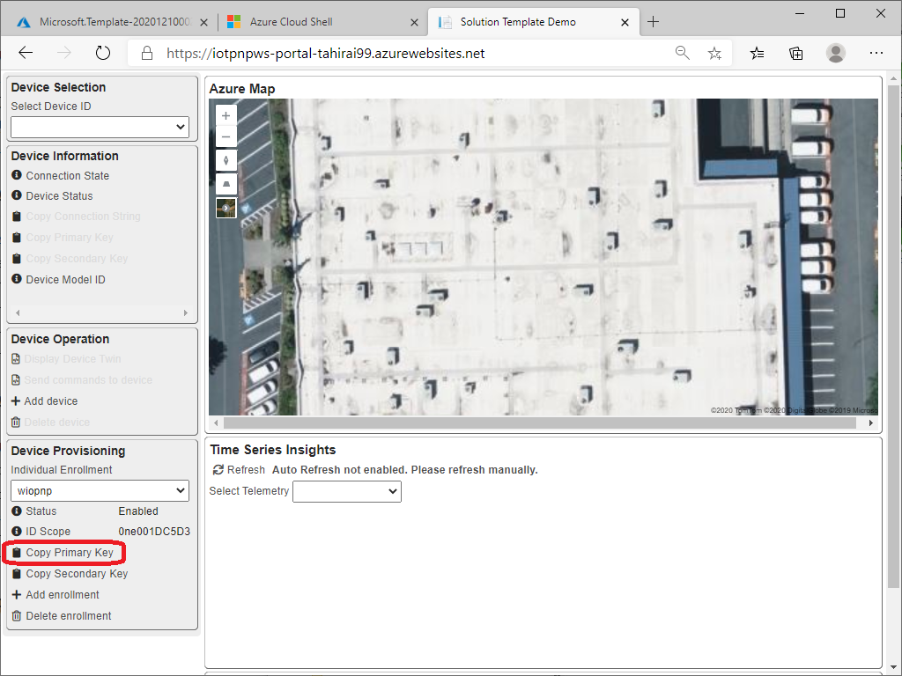
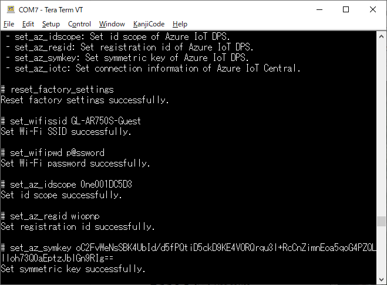
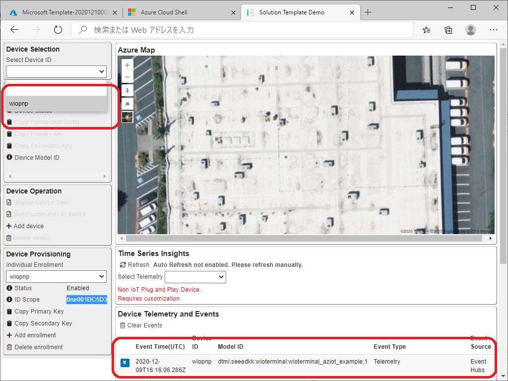
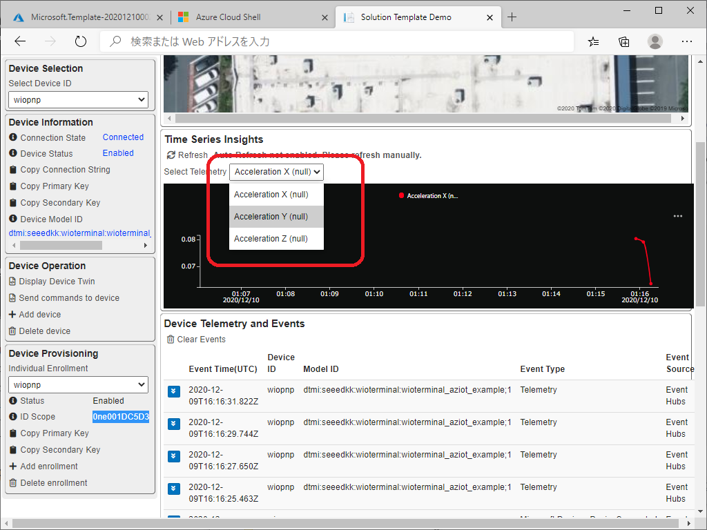

# サンプル IoT ソリューション と IoT Plug and Play 対応デバイス (Wio Terminal) の接続
この HOL では、以下のことを体験します :

- IoT Plug and Play 対応デバイス (Wio Terminal) を サンプル IoT ソリューション へ接続

想定時間は15分から30分です  

## 必須  
- Windows 10 搭載 PC  
    - WEB ブラウザ (Microsoft Edge など)  
    <https://www.microsoft.com/ja-jp/edge>
    - Tera Term (Wio Terminal とのシリアル接続時に利用します)  
    <https://ja.osdn.net/projects/ttssh2/>


## 1. サンプル IoT ソリューションで DPS 関連の情報を取得する
1. 画面左下の add enrollement をクリックします  
  

1. 任意の文字列を入力して Add をクリックします (例: wiopnp)
この文字列をメモ帳等に控えます  
  

1. ID Scope をコピーします  
1. Copy Primary Key をクリックします  
  

ここまでの作業で接続に必要な情報を入手したことになります  

## 2. Wio Terminal に IoT PnP 版のアプリを書き込む  

> [!NOTE]  
> 直前の Azure IoT Central に接続した Wio Terminal (IoT Plug and Play) をそのままお使いいただけます  
> ただし、設定の変更(以下でご案内)は必要です

Wio Terminal を アプリケーション書き込みモード で起動します  

> [!TIPS]
> Wio Terminal の本体左部にあるスライドスイッチを素早く2回下げます  
> 成功すると、PC のエクスプローラに *Arduino* という名前のドライブが表示されます  

1. *Arduino* ドライブに *uf2* 内の *PnP.uf2* をドラッグ＆ドロップします  
書き込みに成功すると、Wio Terminal が自動的に再起動、アプリケーションが開始します  

## 3. Wio Terminal に Azure IoT Hub + DPS 接続設定を書き込む  
Wio Terminal を Configuration Mode (設定モード) で起動します 
> [!TIPS]
> 本体上部の3つ青いボタンを押さえながらケーブルを接続し、電源を入れてください

TeraTerm で接続情報を書き込みます  
まず、一度 Wi-Fi 含めて設定をリセットした上で、設定を書き込んでいきます  

```bash
reset_factory_settings  
set_wifissid (SSID情報)  
set_wifipwd (Wi-Fi パスワード)  
set_az_idscope (ID Scope)  
set_az_regid (先ほど作成した Enrollement)  
set_az_symkey (先ほどコピーした Primary Key)  
```

  

書き込み後、TeraTerm を閉じ、左部のスライドスイッチを1回下げます(再起動します)  

## 4. サンプル IoT ソリューション上での動作を確認する  

デバイスのプロビジョニングが成功すると、自動的にデバイスがソリューションに登録され、また IoT Plug and Play に従ってモデル ID が認識されます  

モデルID が伝わったことで、ソリューション側はデバイスの情報をレポジトリから取得、TSI の画面がそれに従って自動生成されているのが確認出来ます  

これがソリューション側が IoT Plug and Play に対応する、という実例になります  

  
  

[ワークショップ トップページに戻ります](../)  

